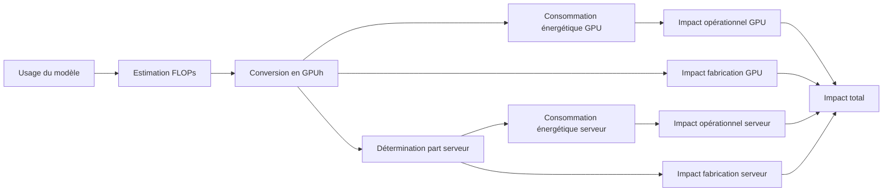

# Méthodologie d'évaluation des impacts environnementaux des IA génératives

## Résumé

Cette note méthodologique propose un cadre de calcul pour évaluer l’empreinte environnementale des modèles d’IA générative, en intégrant l’entraînement, le fine-tuning et l’inférence. La démarche repose sur l’estimation de la charge de calcul (FLOPs) requise par chaque usage, sa conversion en temps d’utilisation des GPU, puis en consommation énergétique et en émissions de gaz à effet de serre (GES). Elle inclut également la part d’impact liée à la fabrication et au cycle de vie des équipements. Cette approche vise à fournir une méthode reproductible, transparente et adaptée à différents modèles et contextes d’usage, en cohérence avec les recommandations de la recherche sur la Green AI[^15].

## Principe

La méthodologie repose sur une philosophie simple : relier directement les usages réels d’un modèle d’IA (entraînement, fine-tuning, inférence) à l’empreinte matérielle nécessaire pour les réaliser.

Plutôt que de partir de mesures globales de consommation électrique au niveau des centres de données, souvent inaccessibles ou propriétaires (Google, 2025[^3][^4]), elle évalue en premier lieu la quantité de calcul exigée par le modèle selon :

- ses caractéristiques propres (taille, nombre de paramètres, proportion de paramètres activés, architecture),
- le volume de jetons consommés ou générés (texte, images, etc.).

Cette charge de calcul est exprimée en FLOPs, puis convertie en temps d’utilisation effectif du matériel (GPUh) en tenant compte de l’efficacité réelle (Model FLOP Utilization, MFU).

L’étape suivante consiste à traduire ce temps d’utilisation en énergie consommée et en émissions GES, à partir des caractéristiques physiques des GPU/serveurs et des conditions d’exploitation (PUE, facteur d’émission électrique).

Enfin, une part de l’impact lié à la fabrication et au cycle de vie des équipements est ajoutée proportionnellement au temps d’usage.

L’étape suivante traduit ce temps d’utilisation en consommation énergétique et en émissions de GES, à partir des caractéristiques physiques des GPU/serveurs et des conditions d’exploitation (PUE, facteur d’émission électrique).

Enfin, une part de l’impact lié à la fabrication et au cycle de vie des équipements est ajoutée proportionnellement au temps d’usage, suivant une logique inspirée de l’Analyse de Cycle de Vie (ACV) (ISO 14040 et 14044).

## Evaluation des impacts

### Estimation de la charge de calcul

| Cas d'usage          | Formule de calcul                                                                           | Variables                                                                                                                                                                                         | Explication                                                                                                                                                                                                                                                                                      | 
|----------------------|---------------------------------------------------------------------------------------------|---------------------------------------------------------------------------------------------------------------------------------------------------------------------------------------------------|--------------------------------------------------------------------------------------------------------------------------------------------------------------------------------------------------------------------------------------------------------------------------------------------------|
| Entraînement         | $FLOP \approx 6 \times P_\text{total} \times T_\text{training}$                             | $P_{total}$ : nombre total de paramètres du modèle $T_{training}$: nombre de tokens traités pendant l'entraînement (tokens × batch × steps)                                                   | Pour chaque jeton et paramètre il faut 6 FLOPs : 2 FLOPs pour la passe forward et 4 pour le calcul de gradient et la propagation (Source : Scaling Law[^1], Transformers FLOPs[^6][^7], Transformers Inference Arithmetic[^8])                                                               |
| Fine tuning          | $FLOP \approx (2 \times P_\text{total} + 4 \times P_\text{tuned}) \times T_\text{training}$ | $P_{total}$ : nombre total de paramètres du modèle $P_{tuned}$ : nombre de paramètres fine tunés $T_{training}$: nombre de tokens traités pendant l'entraînement (tokens × batch × steps) | Idem que pour l'entrainement complet, néanmoins le nombre de paramètres mis à jour est moindre (Source : Scaling Law[^1], Transformers FLOPs[^6][^7], Transformers Inference Arithmetic[^8])                                                                                                 |
| Traitement du prompt | $FLOP \approx 1 \times P_{active} \times T_{input}$                                         | $P_{active}$ : nombre de paramètres actifs $T_{input}$: nombre de tokens du prompt                                                                                                            | Avec le KV cache activé, le prompt est encodé une fois : le coût est réduit à ≈ 1 FLOP par paramètre/token. (Source : Scaling Law[^1], Transformers FLOPs[^6][^7], Transformers Inference Arithmetic[^8])                                                                                    |
| Génération de texte  | $FLOP \approx 2 \times P_\text{active} \times T_\text{output}$                              | $P_{active}$ : nombre de paramètres actifs $T_{output}$: nombre de tokens générés                                                                                                             | Pour chaque jeton et paramètre il faut 2 FLOPs pour la passe forward. Le nombre de paramètres actifs lors de l'inférence dépend de l'architecture du modèle (en particulier pour les MoE). (Source : Scaling Law[^1], Transformers FLOPs[^6][^7], Transformers Inference Arithmetic[^8]) |
| Génération d'image   | $FLOP \approx 2 \times P_\text{active} \times N_\text{activation}$                          | $N_{activations}$: nombre d'activations = largeur x hauteur x nombre de canaux                                                                                                                    | Pour chaque activation et paramètre il faut 2 FLOPs pour la passe forward (Source : Clockwork Diffusion[^2], Transformers Inference Arithmetic)                                                                                                                                              |

### Conversion en usage GPU

Si l'on connait la capacité de traitement en FLOP d'un GPU, il est alors trivial de calculer la durée théorique de son usage afin de satisfaire un des cas d'usage précédent :

$$$D_{gpu} = \frac{FLOP}{(C_{gpu}\times MFU)}$$$

Avec $D_{gpu}$ la durée d'utilisation en heures du GPU,  $C_{gpu}$ la capacité de calcul théorique en FLOP/h du GPU.

La capacité de calcul réellement utilisable par un GPU, en tenant compte de la typologie de modèle, du type de GPU/TPU, du fort parallélisme, des échanges réseaux, etc... représenterait seulement 25 à 50% de la capacité théorique (cf. Benchmarks NVidia[^13]).

Ce taux d'utilisation est appelé $MFU$ (Model Flop Utilization).

### Conversion en consommation d'énergie

Si l'on considère que pendant la durée d'utilisation du GPU sa consommation énergétique est maximale, le calcul de sa consommation d'énergie est simple :

$$$E_{gpu} = D_{gpu} \times P_{gpu}$$$

Avec $P_{gpu}$ la puissance en Watts du GPU

Dans un contexte de centre de données, il est pertinent de multiplier ce chiffre par son $PUE$  (Power Usage Efficiency) afin de tenir compte de son efficacité énergétique.

### Impact environnemental de la consommation d'énergie

Afin d'obtenir l'impact environnemental (par exemple, émissions GES) de l'énergie, il suffit d'appliquer des facteurs d'émissions électriques comme ceux disponibles dans le référentiel Open Data D4B :

$$$I_{operational} = E_{gpu} \times F_{energy}$$$

### Impact environnemental de la fabrication du GPU

L'impact lié à la fabrication du GPU est calculé proportionnellement à la durée d'usage rapportée à la durée de vie estimée du GPU :

$$$I_{embodied} = I_{manufacturing} \times \frac{D_{usage}}{D_{lifespan}}$$$

### Prise en compte des impacts serveur

L’impact des autres composants (CPU, RAM, stockage, châssis) est également pris en compte. Les durées étant exprimées en GPUh, l’impact de ces composants est réparti au prorata du nombre de GPU par serveur. Par exemple, dans un serveur de 8 GPU, un huitième des impacts opérationnels et intrinsèques des composants non-GPU est imputé à chaque GPUh calculée.

$$$I_{total} = I_{gpu} + \frac{I_{server}}{N_{gpu/server}}$$$

## Hypothèses & limites

### Hypothèses

- Lors de l'inférence, un cache (KV) est toujours présent (Transformer Inference Arithmetic).
- Les facteurs d'émissions électriques proviennent du référentiel Open Data D4B.

### Limitations

- Incertitudes sur les données d'entrée : données d’entraînement réelles, caractéristiques des modèles souvent confidentiels, MFU, ...
- Pas de prise en charge des spécificités éventuelles des TPU, FPGA, Asics, ...
- Pas d'ACV fiable sur les équipements.

### Améliorations possibles

- Prendre en compte des métriques publiques comme tokens/s en plus des FLOPs.
- Prendre en compte plus précisément le Time To First Token (latence de l'inférence du prompt + overhead réseau, allocation, ...).
- Intégrer à la méthodologie l'amortissement de l’entraînement sur l’inférence.  
- Adapter le MFU en fonction des caractéristiques du serveur (nombre de GPU par serveur, ...).
- Adapter la méthodologie aux modèles multimodaux (texte, image, vidéo).
- Intégrer des facteurs d’impact multi-critères (énergie primaire, eau, métaux rares).

## Comparaison

Cette section propose une comparaison de méthodologies disponibles pour l’évaluation des impacts environnementaux des modèles d’IA générative. Elle met en évidence leurs périmètres, leurs forces et leurs limites, afin de situer la méthodologie D4B par rapport aux approches existantes.

| Caractéristique                                           | Full ACV (Google, 2025)[^3][^4]                                                                                 | Ecologits[^14]                                                                        | Méthodologie D4B                                                        |
|-----------------------------------------------------------|-----------------------------------------------------------------------------------------------------------------|---------------------------------------------------------------------------------------|-------------------------------------------------------------------------|
| Type d’approche                                           | Mesure full-stack : CPU/DRAM, machines idle, datacenter overhead, eau, ACV partielle du hardware                | Evaluation bottom-up appliqué à l’inférence uniquement (usage + fabrication)          | Modélisation FLOPs → GPUh → Impacts                                     |
| Périmètre                                                 | Fabrication (partielle), usage (tous composants serveur), infrastructure datacenter, eau, émissions Scope 2/3   | Usage infra + fabrication, inférence seulement                                        | Usage entraînement, fine tuning, inférence + fabrication GPU et serveur |
| Granularité & mesure                                      | Très fine : mesures réelles sur production Gemini, énergie, eau, émissions                                      | Moyenne haute, open data multi-critères (GWP, PE, ADPe) agrégés par appel API         | Moyenne modérée : dépend des données disponibles (FLOPs, TDP, ...)      |
| Accessibilité                                             | Faible : données internes Google peu explicitées                                                                | Elevée : code open-source, API ouverte                                                | Elevée : méthodes et hypothèses documentées publiquement                |
| Reproductibilité                                          | Faible : instrumentation propriétaire et données internes                                                       | Forte : outil public, calculs transparents et reproductibles                          | Moyenne à élevée : si les données d’entrée sont estimables              |
| Transparence                                              | Moyenne : publication méthode mais accès aux données limité                                                     | Forte : codes, hypothèses et modèle open source                                       | Forte : toutes les formules et sources sont explicitées                 |
| Précision (sur inférence)                                 | Très élevée : vrai déploiement mesuré, inclut spectre complet d’énergie                                         | Moyenne : repose sur modèles simplifiés et hypothèses généralisées                    | Moyenne à élevée selon la précision des paramètres choisis              |
| Applicabilité                                             | Limitée : spécifique à l’infrastructure Google et inférence                                                     | Moyenne : inférence sur divers fournisseurs, mais pas entraînement                    | Très large : entraînement, fine tuning, inférence sur base publique     |
| Usages visés                                              | Analyse interne, reporting fin, communication                                                                   | Évaluation publique, sensibilisation, comparateur multi-fournisseurs                  | Recherche, évaluation interne, FinOps, Green AI                         |
| Résultats chiffrés (Prompt moyen, environ 400 jetons) | ~0,03 gCO2e Gemini                                                                                              | ~40 gCO2e LLama 3.1 405b                                                              | ~0,1 gCO2e LLama 3.1 405b (cf. Applications)                        |
| Limites clés                                              | Données propriétaires, ne couvre pas l’entraînement, se concentre sur l'inférence, biais sur le “prompt median” | Périmètre limité (inférence seule), possible surestimation du fait de l'extrapolation | Dépend fortement des hypothèses (MFU, durée de vie)                     |

Ces résultats montrent que chaque approche a un positionnement spécifique : Google privilégie la précision mais reste fermé et non reproductible, Ecologits mise sur la transparence et la simplicité mais au prix d’une surestimation possible, tandis que la méthodologie D4B propose un compromis reproductible et adaptable aux différents contextes d’usage mais dépend de la précision des données d'entrée.

## Application

Cette section a pour but d'évaluer le modèle en utilisant les données publiques du modèle LLM Open source Llama 3.1 (405B paramètres).

### Hypothèses matérielles

Le NVIDIA DGX H100 est une configuration "classique" sur laquelle sont exécutés les traitements.

| Caractéristiques     | Composant                                                  | Puissance                          | Impact cycle de vie (approximatif)           |
|----------------------|------------------------------------------------------------|------------------------------------|----------------------------------------------|
| CPU                  | 2 x Intel Xeon Platinum 8480C processors (112 cores total) | 2 x 350 = 700 W                    | 2 x 25 = 50 kgCO2e                           |
| RAM                  | 2TB2 x 1024 x 0.392 = 803 W                                | 2 x 1024 x 533 / 284 = 3843 kgCO2e |                                              |
| Storage              | 30 TB SSD                                                  | 30 x 1024 x 0.0012 = 37 W          | 30 x 1024 x 0.16 = 4915 kgCO2e               |
| GPU                  | 8 x H100 80 GB(989 TFLOP/s par GPU)                        | 8 x 700 W                          | 8 x 250 kgCO2e                               |
| Chassis              |                                                            | -                                  | 250 kgCO2e                                   |
| Total (hors GPU)     |                                                            | 1540 W                             | 9058 kgCO2e                                  |
| Total (hors GPU) / h |                                                            | 1540 W                             | 9058 / (5 x 24 x 365, 25) = 0,206 kgCO2e / h |

### Impact de l'entrainement

Llama 3.1 (405B paramètres) a été entrainé avec environ 15 trillions (15e12) jetons.
D'après Huggingface, il a été entrainé avec 24576 GPU H100 :
Training Time (GPU hours)	Power Consumption (W)	Emissions (tons CO2eq)
Llama 3.1 8B	1.46M	700	420
Llama 3.1 70B	7.0M	700	2 040
Llama 3.1 405B	30.84M	700	8 930

D'après les formules du modèle et en prenant pour hypothèse un MFU de 40% (à affiner d'après les benchmarks NVIDIA[^13] il pourrait être plus proche de 35%) pour l'entrainement, un PUE de 1,2 et un facteur d'émission GES de 0,420 kgCO2e / kWh :

$$$
\begin{aligned}
&FLOP_{training} = 6 \times P_{total} \times T_{training} = 6 \times 405e9 \times 15e12 = 3,65e25 FLOP \\
&D_{training} = \frac{FLOP_{training}}{FLOP_{gpu} \times MFU} = \frac{FLOP_{training}}{989e12 * 3600 \times 0,40} = 25,6e6 GPU.h \\
&E_{training} = 0,700 \times D_{training} \times PUE = 21,5e6 kWh \\
&I^{gpu}_{training_{ope}} = 0,420 \times E_{training} = 9 030 tCO2e \\
\end{aligned}
$$$

:::note
L'écart entre les données fournies sur Huggingface et le calcul est < 2% ce qui reste très raisonnable.
:::

Pour l'impact intrinsèque, on prend pour hypothèse une durée de vie des équipements de 5 ans :

$I^{gpu}_{training_{emb}} = \frac{D_{training}}{D_{lifespan}} \times I_{total_{emb}} = \frac{25,6e6}{(5 \times 24 \times 365,25)} \times 250 = 146 tCO2e$

:::note
On constate que l'impact intrinsèque est considérablement plus faible que l'impact opérationnel.
:::

A l'impact du GPU il convient d'ajouter l'impact opérationnel et intrinsèque du serveur. Il y a 8 GPUs par serveur, donc on ajoute 1 / 8 des composants autres que GPU.

$$$
\begin{aligned}
&I_{training_{ope}} = I^{gpu}_{training_{ope}} + \frac{I^{server}_{training_{ope}}}{8} = 9030 + \frac{25,6e6 \times 1,540 \times 0,420 \times 1,2 }{8} = 11513 tCO2e \\
&I_{training_{emb}} = I^{gpu}_{training_{emb}} + \frac{I^{server}_{training_{emb}}}{8} = 146 + \frac{25,6e6 \times 0,000206}{8} = 805tCO2e
\end{aligned}
$$$

### Impact de la génération d'1 million de jetons

Dans le cloud, lorsqu'on utilise un LLM en mode "complétion", grâce au KV caching les jetons d'entrée n'entraînent qu'un coût linéaire par jeton de sortie, car l'attention n'est recalculée que sur les nouveaux jetons générés.

$$$
\begin{aligned}
&I^{gpu}_{output_{ope}} = \frac{2 \times 405e9 \times 1e6}{989e12 \times 3600 \times 0,40} \times (0,700 + \frac{1,540}{8}) \times 1,2 \times 0,420 = 256gCO2e \\
&I^{gpu}_{output_{emb}} = \frac{2 \times 405e9 \times 1e6}{989e12 \times 3600 \times 0,40} \times \frac{250 + \frac{9058}{8}}{5\times24\times365,25} = 18gCO2e
\end{aligned}
$$$

Si l'on considère une taille de "prompt moyen" d'environ 400 jetons, alors l'impact d'une requête est d'environ 0,1 gCO2e.

[^1]: J. Kaplan, S. McCandlish, ..., 2020. [Scaling Laws for Neural Language Models](https://arxiv.org/pdf/2001.08361)
[^2]: A. Habibian, A. Ghodrati, ... 2024. [Clockwork Diffusion: Efficient Generation With Model-Step Distillation](https://arxiv.org/html/2312.08128v2)
[^3]: Google, 2025. [Measuring the environmental impact of delivering AI at Google Scale](https://services.google.com/fh/files/misc/measuring_the_environmental_impact_of_delivering_ai_at_google_scale.pdf)
[^4]: Google, 2025. [Life-Cycle Emissions of AI Hardware: A Cradle-To-Grave Approach and Generational Trends](https://arxiv.org/pdf/2502.01671)
[^5]: J. You, 2025. [How much energy ChatGPT use](https://epoch.ai/gradient-updates/how-much-energy-does-chatgpt-use)
[^6]: A. Casson, 2023. [Transformer FLOPs](https://www.adamcasson.com/posts/transformer-flops)
[^7]: D. Bahdanau, 2022. [The FLOPs Calculus of Language Model Training](https://medium.com/@dzmitrybahdanau/the-flops-calculus-of-language-model-training-3b19c1f025e4)
[^8]: C. Chen, 2023. [Transformer Inference Arithmetic](https://kipp.ly/transformer-inference-arithmetic/)
[^9]: Huggingface, 2022. [Understanding FLOPs-per-token estimates from OpenAI’s scaling laws](https://discuss.huggingface.co/t/understanding-flops-per-token-estimates-from-openais-scaling-laws/23133?utm_source=chatgpt.com)
[^10]: D. Patterson, 2022. [The Carbon Footprint of Machine Learning Training Will Plateau, Then Shrink](https://arxiv.org/pdf/2204.05149)
[^11]: Google, 2022. [PaLM: Scaling Language Modeling with Pathways](https://arxiv.org/pdf/2204.02311)
[^12]: Meta, 2024. [The Llama 3 Herd of Models](https://arxiv.org/pdf/2407.21783)
[^13]: NVidia, 2025. [Llama 3.1 70B 24.11.1 (DGXC Benchmarking)](https://catalog.ngc.nvidia.com/orgs/nvidia/teams/dgxc-benchmarking/resources/llama31-70b-dgxc-benchmarking-a?utm_source=chatgpt.com)
[^14]: GenAI Impact. [EcoLogits](https://ecologits.ai/latest/methodology/)
[^15]: Schwartz et al., 2020 ; Henderson et al., 2020. [Green AI](https://arxiv.org/pdf/1907.10597)
