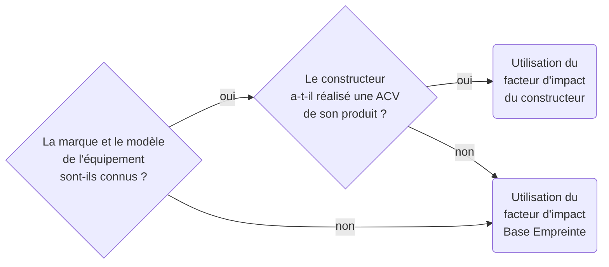

---
sidebar_label: Générale
sidebar_position: 4
slug: /general
--- 

# Méthodologies d'évaluation des impacts environnementaux 

## Impacts environnementaux d’un équipement

### Choix du facteur d’impact environnemental

Le facteur à prendre en compte est déterminé par l’arbre de décision suivant qui privilégie les facteurs les plus discriminants :

:::note
Cette arborescence vaut autant pour les facteurs d’impact intrinsèques que pour les consommations électriques.
:::

Les données constructeurs ne sont pas toujours fiables, et surtout peu comparables. Les périmètres pris en compte différents, les résultats ne sont pas tous certifiés et les méthodologies par toujours partagées. Toutefois, nous estimons aujourd'hui que les données constructeurs fournissent une estimation plus proche de notre périmètre que l’application systématique des facteurs génériques de la base empreinte.

L’évolution des référentiels disponibles et un meilleur cadrage des ACV produits pourraient nous amener à réinterroger ce choix dans l’avenir. 

### Impact intrinsèque d’un équipement

$$
\begin{align*}
&I_{embodied_{i}} = D_{usage} \times IF_{embodied_{i}}\htmlClass{unit}{[U_i]}\\
Avec\\
&I_{embodied_{i}} = \text{Impact intrinsèque de l'équipement pour l’indicateur environnemental}\textit{ i }\htmlClass{unit}{[U_i]}\\
&D_{usage} = \text{Durée d’usage du terminal dédiée à l'utilisation du service}\htmlClass{unit}{[s]}\\
&IF_{embodied_{i}} = \text{Facteur d’impact intrinsèque pour l’indicateur environnemental}\textit{ i }\htmlClass{unit}{[U_i/s]}\\
\end{align*}
$$

:::note 
La formule de calcul est donnée dans les unités standards avec des temps en seconde. Toutefois, selon le procédé évalué, il conviendra d’utiliser la même formule avec des unités de temps autre que la seconde (mois, années…)
:::

Certains facteurs $IF_{embodied_{i}}$ sont fournis pour une quantité de référence (1 an par exemple) et en tenant compte d’une durée de vie théorique. Celle-ci peut différer de la durée de vie réelle de l’équipement étudié. Une règle de proportionnalité est appliquée lorsque cette durée de vie réelle est connue, afin de prendre en compte le contexte de l’équipement. Les durées de vies étant en général fournies en années, le facteur $IF_{embodied_{i}}$ corrigé est évalué en x par an (x per year) selon la formule ci-dessous et l’équation de calcul de l’impact intrinsèque est passée dans une unité de temps en années.

$$
\begin{align*}
&IF_{embodied_{i}} = TIF_{embodied_{i}} \times \frac{TL}{RL} \htmlClass{unit}{[U_i/s]}\\
Avec\\
&IF_{embodied_{i}} = \text{Facteur d’impact intrinsèque pour l’indicateur environnemental}\textit{ i }\htmlClass{unit}{[U_i/s]}\\
&TIF_{embodied_{i}} = \text{Facteur d’impact intrinsèque théorique pour l’indicateur environnemental}\textit{ i }\htmlClass{unit}{[U_i/s]}\\
&TL = \text{Durée de vie théorique de l'équipement fournie par le référentiel}\htmlClass{unit}{[s]}\\
&RL = \text{Durée de vie réelle de l'équipement}\htmlClass{unit}{[s]}\\
\end{align*}
$$

### Impact opérationnel d’un équipement

L’impact opérationnel s’évalue à partir de l’impact de consommation électrique, qui lui-même s’évalue à partir des caractéristiques d’utilisation selon la formule suivante :

$$
\begin{align*}
&E_{elec} = D_{usage} \times P_{elec}\htmlClass{unit}{[kWh]}\\
Avec\\
&E_{elec} = \text{Consommation d'électricité de l'équipement}\htmlClass{unit}{[kWh]}\\
&D_{usage} = \text{Durée d’usage du terminal dédiée à l'utilisation du service}\htmlClass{unit}{[h]}\\
&P_{elec} = \text{Puissance moyenne de l'équipement sur la durée d'utilisation}\htmlClass{unit}{[kW]}\\
\end{align*}
$$

La conversion de la consommation électrique en impact opérationnel se fait sur la base de la formule fournie dans le paragraphe [Conversion d’une consommation d’électricité en impact opérationnel](concepts.md#conversion-dune-consommation-délectricité-en-impact-opérationnel).

## Impacts environnementaux du réseau

Certaines parties du réseau relèvent d’opérateurs externes (WAN, Internet, 4G…) et cette externalité limite beaucoup la connaissance et la maîtrise des équipements mis en jeu dans le réseau.

Conformément aux principes posés par le RCP mère sur les services numériques (cf. [Approche équipement et approche système](principles.md#approche-équipement-et-approche-système)), l’évaluation d’un périmètre réseau pourra faire appel à une approche matériel et/ou une approche système en fonction du niveau de maîtrise du périmètre ou des sous-parties qui le compose. 

### Approche « équipement » pour un réseau

L’approche « équipement » est mise en œuvre lorsque le matériel qui compose le réseau est connu, suivi et maîtrisé. Cette approche est généralement mise en œuvre pour couvrir des périmètres réseau interne à un site et géré par l’organisation à l’origine de l’évaluation.

Dans ce cas, l’organisation effectue l’inventaire et la caractérisation des matériels qui composent son réseau. L’impact de chaque matériel est évalué conformément au paragraphe [Impacts environnementaux d’un équipement](general.md#impacts-environnementaux-dun-équipement).

L’impact total du réseau est égal à la somme des impacts de chaque matériel composant le réseau. 

### Approche « système » - Cas d’un réseau externe, type WAN

L’approche « système » est mise en œuvre lorsqu’on ne connaît pas les équipements qui composent le périmètre réseau étudié. Cette approche est généralement mise en œuvre pour couvrir des périmètres réseau gérés par des opérateurs. Le périmètre réseau est alors assimilé à un système fermé au niveau duquel on dispose de facteurs d’impacts. Ce système peut être décomposé en différents tronçons en fonction de la typologie de réseaux utilisée (fixe et/ou mobile) et des distances parcourues.

La quantité de données transférées par le réseau (en octets, notés o, ou pour l’anglais en Bytes, noté B, à ne pas confondre avec les bits, notés b minuscule) constitue la donnée d’entrée pour cette approche « système », l’allocation des réseaux étant basée sur les octets transférés.

#### Spécificités des réseaux externes, type WAN

##### Content delivery network (CDN)

Lorsqu’un [CDN](glossary.md#cdn-content-delivery-network) est présent dans l’organisation d’un réseau, l’impact intrinsèque des serveurs associés est à prendre en compte ainsi que la proportion de données qui poursuit son chemin après le CDN, jusqu’au centre de données.

Un CDN amène à considérer que le flux de données peut être décomposé en trois segments :
- Un segment allant de l’utilisateur au point d’entrée le plus proche du CDN. Ce premier segment est généralement situé à l’intérieur d’un pays 
- Un segment allant du point d’entrée au point de sortie, qui est le point le plus proche du centre de données. Ce tronçon peut être international. 
- Un segment allant du point de sortie au datacenter. Ce segment est généralement interne au pays.
     
En conséquence, un CDN est d’autant plus efficace que la distance est importante entre l’utilisateur et le centre de données. Il est adapté pour les transferts internationaux, ou intra nationaux dès lors que les points d’entrée et le point de sortie du CDN sont différents.

Par ailleurs, un CDN offre systématiquement une technologie de mise en cache des données, dès le point d’entrée. Il en résulte que la quantité de données circulant est largement diminuée entre le premier segment et les deux autres, typiquement de l’ordre de 70% à 90%. L’effet est doublement bénéfique puisque l’utilisation des équipements réseau est préservé ainsi que la sollicitation des serveurs du centre de données.

##### Dimension géographique des réseaux

Contrairement aux équipements et aux hébergements, le périmètre réseau couvre physiquement des distances qui peuvent aller de quelques mètres à plusieurs milliers de kilomètres, traversant potentiellement plusieurs pays.
     
La méthodologie proposée intègre un facteur de distance qui permet d’adapter le facteur d’émission à la dimension du pays dans lequel se trouve les activités numériques et augmente l’impact si la distance parcourue est plus importante. S’il y a plus de distance à parcourir, il y aura davantage d’équipements sollicités donc l’impact sera plus important.
     
La valeur de la distance en km à appliquer dans les formules est dépendante du segment parcouru :

- Cas d’un segment interne 
  - Un segment interne correspond à un tronçon de réseau présent uniquement sur le territoire national d’un pays. Dans l’évaluation, on applique alors un facteur de distance égal à la distance moyenne entre le barycentre du pays et la frontière. 
  - Cette distance repose sur l’estimation du rayon $r$ d’un pays à partir de sa surface $A$, en utilisant la formule $r = \sqrt{A/\pi}$. La surface $A$ des pays provient d’une agrégation de plusieurs sources regroupées dans un [article Wikipedia](https://en.wikipedia.org/wiki/List_of_countries_and_dependencies_by_area).

- Cas d’un segment interpays 
  - Un segment interpays correspond à la distance parcourue par un réseau lorsqu’il quitte un pays de départ (pays de l’utilisateur) pour relier un pays de destination (pays du centre de données). Dans l’évaluation, on applique alors un facteur de distance égal à la distance moyenne entre le pays de départ et de destination. 
  - La distance est estimée entre les barycentres de chaque pays. Les données des barycentres proviennent de l’API Google Maps. L’estimation des distances repose sur la route orthodromique entre deux points A et B du globe terrestre, qui correspond à la route la plus courte entre les 2 points. Pour calculer cette distance, on utilise la formule des cosinus de la trigonométrie sphérique : $AB = arccos[sin(la) \times sin(lb) + cos(la) \times cos(lb) \times cos(LB − LB)]$

Selon ces principes, Digital4better a calculé les facteurs de distances par pays et par type de segment. Les données sont disponibles en opendata sur le [Github Digital4Better](https://github.com/digital4better/data/tree/main/data/country). 

##### Typologies de réseau (fixe/mobile)

Les facteurs d’impact actuellement disponibles distinguent 2 typologies de réseaux : les réseaux mobiles (2G, 3G, 4G, 5G) et les réseaux fixes (xDSL, FFTx). La méthodologie propose en conséquence 2 typologies de réseaux pour prendre en compte au mieux la répartition des usages entre réseau fixe et mobile :
- Les réseaux mixtes comportent à la fois des connexions mobiles et des connexions filaires 
- Les réseaux fixes comportent uniquement des connexions fixes

##### Facteurs d’impacts environnementaux

Pour mettre en œuvre les 2 points précédents (facteur de distance et distinction fixe/mobile), il est nécessaire d’opérer un ajustement des facteurs d’impacts environnementaux existants.
     
Les facteurs initiaux sont ceux fournis par la Base Empreinte ADEME en décembre 2023 (Onglet « Services Numériques », lignes 42 et 43 dédiées aux services réseaux) : 
 
| 	Nom de la donnée	                                       | Quantité de référence	 | Unité	 | Localisation | 	Description technologique                                                                                                                                                                                                                                                                                                                                                                        |
|----------------------------------------------------------|------------------------|--------|--------------|---------------------------------------------------------------------------------------------------------------------------------------------------------------------------------------------------------------------------------------------------------------------------------------------------------------------------------------------------------------------------------------------------|
| Impact de la transport d'1Go de donnée via réseau fixe   | 	1                     | 	Go	   | France       | 	Fixed-line network; at consumer; xDSL, FFTx average mix; FR Seuls les équipements basés sur le territoire français sont inclus. Les autres équipements, tels que les équipements réseaux utilisés par les acteurs français mais basés sur d'autres territoires ne sont pas pris en compte. Les données proviennent de l'installation des équipements et de la consommation d'énergie de 2020 |
| Impact de la transport d'1Go de donnée via réseau mobile | 	1                     | 	Go    | 	France      | 	Mobile network; at consumer; 2G, 3G, 4G, 5G average mix ; FR Les données proviennent de l'installation des équipements et de la consommation d'énergie de 2020                                                                                                                                                                                                                               |

Ces facteurs sont estimés pour la France. Par cohérence à notre modèle basé sur la distance nous avons effectué une transformation pour obtenir des facteurs par km (division par le rayon estimé du territoire de la France).

Nous avons aussi intégré intègre l’impact d’une box sur le réseau fixe, en prenant en compte une volumétrie de 220go par mois par box[^1].
[^1]:Rapport ICT 2020 et extrait du rapport de l’ADEME/Arcep « Evaluation environnementale des équipements et infrastructures numériques en France, 2ème volet » de janvier 2022.

Les résultats de ces ajustements sont fournis dans le tableau ci-dessous. Pour l’impact opérationnel, les données sont à récupérer sur la ligne « Impact énergie en kWh/octet/km». Pour l’impact intrinsèque, les données sont à récupérer en fonction de l’indicateur environnemental étudié, dans les autres lignes du tableau. 

| Réseau                                                     | Fixe + Box | _Fixe_       | _Box_        | Mobile     |
|------------------------------------------------------------|------------|--------------|--------------|------------|
| Quantité d'électricité nécessaire pour le procédé (kWh/Go) | 1,03E-01   | _6,87E-02_   | _3,43E-02_   | 2,36E-01   |
| Impact énergie en kWh/octet/km                             | 2,30E-13   |              |              | 5,28E-13   |
| PEF-ADPe (kg SB eq./octet/km)                              | 3,82E-19   | _3,75E-19_   | _7,45E-21_   | 2,41E-18   |
| PEF-AP (mol H+ eq./octet/km)                               | 7,58E-17   | _4,55E-17_   | _3,03E-17_   | 4,51E-17   |
| PEF-CTUe (CTUe/octet/km)                                   | \-7,08E-14 | _\-6,36E-14_ | _\-7,23E-15_ | \-4,58E-13 |
| PEF-CTUh-c (CTUh/octet/km)                                 | 2,83E-23   | _1,21E-23_   | _1,62E-23_   | \-1,50E-23 |
| PEF-CTUh-nc (CTUh/octet/km)                                | \-2,06E-22 | _\-1,50E-22_ | _\-5,55E-23_ | \-7,70E-22 |
| PEF-GWP (kg CO2 eq./octet/km)                              | 1,60E-14   | _9,89E-15_   | _6,10E-15_   | 1,78E-14   |
| PEF-IR (kg U235 eq./octet/km)                              | 6,18E-14   | _3,91E-14_   | _2,27E-14_   | 7,66E-14   |
| PEF-PM (Disease occurrence/octet/km)                       | 6,07E-22   | _3,93E-22_   | _2,14E-22_   | 6,20E-22   |
| PEF-WU (m3 eq./octet/km)                                   | \-2,52E-13 | _\-1,81E-13_ | _\-7,13E-14_ | \-9,93E-13 |

Dans le cas d’un réseau mixte (fixe + mobile), le facteur d’impact environnemental est une combinaison des facteurs réseau fixe et réseau mobile, tenant compte des caractéristiques de connexion et d’utilisation.

Le facteur de conversion pour un indicateur environnemental X est calculé selon la formule suivante : 

$$
\begin{align*}
&CF_{embodied_{i}} = \sum_{e \in \{mobile, desktop\}} P_e \times \left( \sum_{n \in \{fixed, cellular\}} P_{e,n} \times CF_{embodied_{e,n,i}} \right) \htmlClass{unit}{[U_i/o/km]}\\
Avec \\
&CF_{embodied_{i}} = \text{Facteur de conversion pour l'indicateur}\textit{ i }\htmlClass{unit}{[U_i/o/km]}\\
&P_e = \text{Pourcentage d'usage d'équipement}\textit{ e }\\
&P_{e,n} = \text{Pourcentage d'usage de réseau}\textit{ n }\text{pour l'équipement}\textit{ e }\\
&CF_{embodied_{e,n,i}} = \text{Facteur de conversion pour l'indicateur}\textit{ i }\text{le réseau}\textit{ n }\text{et l'équipement}\textit{ e }\htmlClass{unit}{[U_i/o/km]}\\
\end{align*}
$$

Cette formule s’applique également dans le cas de facteurs de consommation d’électricité, pour l’évaluation des impacts opérationnels. Les valeurs de ImpactXMobileNetwork et ImpactXFixedNetwork seront à chercher dans la ligne « Quantité d'électricité nécessaire pour le procédé (kWh/Go) » du tableau des facteurs.

Dans le cas d’un réseau fixe, la même formule s’applique mais se simplifie par l’absence de réseau mobile :
-	$P_{mobile} = 0$
-	$P_{desktop} = 1$
-	$P_{desktop,cellular} = 0$
     
Le facteur d’impact environnemental est directement égal au facteur « réseau fixe » fourni dans le tableau ci-dessus. 

##### Evaluation de l’impact environnemental

Le réseau WAN est décomposé en 1 ou plusieurs segments, eux-mêmes composés de réseaux mixtes et/ou fixes selon la nature des connexions.

###### Impact intrinsèque d’un segment réseau

La formule ci-dessous permet le calcul de l’impact intrinsèque d’un segment :

$$
\begin{align*}
&SI_{embodied_{i}} = V * L * CF_{embodied_{i}}\htmlClass{unit}{[U_i]}\\
Avec \\
&SI_{embodied_{i}} = \text{Impact intrinsèque du segment pour l’indicateur}\textit{ i }\htmlClass{unit}{[U_i]}\\
&V = \text{Volume de données transférées dans le réseau}\htmlClass{unit}{[o]}\\
&L = \text{Longueur du segment de réseau}\htmlClass{unit}{[km]}\\
&CF_{embodied_{i}} = \text{Facteur de conversion pour l’indicateur}\textit{ i }\htmlClass{unit}{[U_i/o/km]}\\
\end{align*}
$$

###### Impact opérationnel d’un segment réseau

La formule ci-dessous permet le calcul de la consommation d’électricité pour le transfert de données sur un segment du réseau :

$$
\begin{align*}
&SE_{elec_n} = V * L * CF_{elec_n}\htmlClass{unit}{[kWh]}\\
Avec \\
&SE_{elec_n} = \text{Consommation d’électricité du segment de réseau}\textit{ n }\htmlClass{unit}{[kWh]}\\
&V = \text{Volume de données transférées dans le réseau}\htmlClass{unit}{[o]}\\
&L = \text{Longueur du segment de réseau}\htmlClass{unit}{[km]}\\
&CF_{elec_n} = \text{Facteur de conversion pour l'énergie du segment de réseau}\textit{ n }\htmlClass{unit}{[kWh/o/km]}\\
\end{align*}
$$

La conversion de la consommation électrique en impact opérationnel se fait sur la base de la formule fournie au paragraphe [Conversion d’une consommation d’électricité en impact opérationnel](concepts.md#conversion-dune-consommation-délectricité-en-impact-opérationnel)

###### Impact total du réseau

L’impact du réseau est alors égal à la somme des impacts par segment :

$$
\begin{align*}
&I_{i} = \sum_{t \in \{operational,embodied\}} \sum_{k=1}^n SI_{t_{k,i}}\htmlClass{unit}{[U_i]}\\
Avec \\
&I_{i} = \text{Impact du réseau composé de}\textit{ n }\text{segments pour l’indicateur environnemental}\textit{ i }\htmlClass{unit}{[U_i]}\\
&SI_{t_{k,i}} = \text{Impact}\textit{ t }\text{du segment}\textit{ k }\text{pour l’indicateur environnemental}\textit{ i }\htmlClass{unit}{[U_i]}\\
\end{align*}
$$

Conformément aux éléments déjà présentés, l’impact réseau de chaque segment en composé d’un impact intrinsèque et d’un impact opérationnel. 

### Approche « système » - Cas d’un réseau interne, type LAN

Une approche système est réalisée sur des réseaux internes de type LAN lorsque l’organisation ne maîtrise pas les équipements mis en œuvre. C’est le cas par exemple lorsque le réseau d’un site est confié à un prestataire, lorsque l’organisation partage son réseau avec d’autres organisations ou pour prendre en compte la partie réseau interne d’un datacenter. 

#### Impact intrinsèque

La formule ci-dessous permet le calcul de l’impact intrinsèque pour le transfert sur un réseau interne : d

$$
\begin{align*}
&I_{embodied_{i}} = V * CF_{embodied_{i}}\htmlClass{unit}{[U_i]}\\
Avec \\
&SI_{embodied_{i}} = \text{Impact intrinsèque du réseau pour l’indicateur}\textit{ i }\htmlClass{unit}{[U_i]}\\
&V = \text{Volume de données transférées dans le réseau}\htmlClass{unit}{[o]}\\
&CF_{embodied_{i}} = \text{Facteur de conversion pour l’indicateur}\textit{ i }\htmlClass{unit}{[U_i/o]}\\
\end{align*}
$$

:::warning[Limitation]
Nous n’avons pas de facteur d’impact intrinsèque connu à ce jour, nous devons donc faire une exclusion de l’évaluation des impacts intrinsèque du réseau LAN dans nos évaluations.
::: 

#### Impact opérationnel

La formule ci-dessous permet le calcul de la consommation d’électricité pour le transfert sur un réseau interne : 

$$
\begin{align*}
&E_{elec} = V * CF_{elec}\htmlClass{unit}{[kWh]}\\
Avec \\
&E_{elec} = \text{Consommation électrique du réseau}\htmlClass{unit}{[kWh]}\\
&V = \text{Volume de données transférées dans le réseau}\htmlClass{unit}{[o]}\\
&CF_{elec} = \text{Facteur de conversion pour l’énergie}\htmlClass{unit}{[kWh/o]}\\
\end{align*}
$$

Pour un réseau interne, $CF_{elec}$ est fixé par défaut à 0,001 kWh/Gb, valeur choisie selon la méthodologie décrite par [Cloud Carbon Footprint](https://www.cloudcarbonfootprint.org/docs/methodology/#chosen-coefficient).

La conversion de la consommation électrique en impact opérationnel se fait sur la base de la formule fournie dans le paragraphe [Conversion d’une consommation d’électricité en impact opérationnel](concepts.md#conversion-dune-consommation-délectricité-en-impact-opérationnel).

:::warning
Le facteur d’impact utilisé ici reste expérimental et plutôt orienté centre de données qu’organisation.
:::

## Impacts environnementaux d’un centre de données

### Spécificités du périmètre centre de données

Un centre de données est un lieu où sont regroupés les équipements permettant d’organiser, stocker et traiter de grandes quantités de données (serveurs, baies de stockage, équipements réseaux et de télécommunications, etc…).

Le centre de données inclut également du matériel permettant le refroidissement (climatisation, …), la sécurisation (dispositifs anti-incendie, anti-effraction, …), la gestion (espaces de travail, ateliers, …) et l’alimentation (PSU, générateurs de secours) de ces équipements.

#### Périmètre de l’évaluation des impacts

Cette méthodologie a vocation d’analyser tout ou partie d’un centre de données, en fonction du cas d’usage (analyse globale de l’infrastructure, analyse d’un service web, …).

Dans le cas d’une analyse partielle, seuls les équipements nécessaires à la délivrance du service sont inclus dans le périmètre.

#### Efficacité énergétique du centre de données

L’efficacité énergétique d’un centre de données est définie par le ratio entre l’énergie totale consommée par un centre de données et l’énergie réellement consommée par les équipements délivrant le service informatique. Ce ratio est dénommé [PUE (Power Usage Effectiveness)](glossary.md#pue-power-usage-effectiveness).

$$
\begin{align*}
&PUE = \frac{E_{datacenter}}{E_{servers}}\\
Avec \\
&PUE = \text{Efficacité énergétique}\\
&E_{datacenter} = \text{Énergie totale consommée par le centre de données}\htmlClass{unit}{[kWh]}\\
&E_{servers} = \text{Énergie consommée par les serveurs}\htmlClass{unit}{[kWh]}\\
\end{align*}
$$

Plus ce ratio se rapproche de 1, plus la consommation d’énergie du centre de données est efficace.

Si le PUE n’est pas connu, nous utilisons une valeur par défaut correspondant à la moyenne des PUE monde fournit par [Uptime Institute](https://journal.uptimeinstitute.com/global-pues-are-they-going-anywhere/) : 1,58.

#### Consommation d’énergie renouvelable

Certains centres de données produisent leur propre énergie, basée sur des technologies de production d’énergie renouvelable (par le biais de panneaux photovoltaïque, de centrale hydroélectrique, …). Ce ratio d’énergie renouvelable est souvent dénommé REF (Renewable Energy Factor).

Certains fournisseurs cloud incluent dans ce REF la part d’énergie renouvelable à laquelle ils souscrivent via des contrats avec des fournisseurs « d’énergie verte » en vue de consommer l’énergie la plus décarbonnée possible.

#### Prise en compte dans l’évaluation de l’impact opérationnel

Dans le cas où la consommation électrique est évaluée à partir des équipements, un calcul complémentaire est nécessaire pour prendre en compte l’énergie consommée pour les activités annexes du centre de données et matérialisée au travers du PUE. On obtient ainsi la consommation électrique totale du centre de données :

$$
\begin{align*}
&E_{elec} = E_{usage} \times PUE\htmlClass{unit}{[kWh]}\\
Avec \\
&E_{elec} = \text{Énergie totale consommée par le centre de données}\htmlClass{unit}{[kWh]}\\
&E_{usage} = \text{Énergie consommée par les équipements}\htmlClass{unit}{[kWh]}\\
&PUE = \text{Efficacité énergétique}\\
\end{align*}
$$

La conversion de la consommation électrique en impact opérationnel se fait sur la base de la formule fournie au paragraphe [Conversion d’une consommation d’électricité en impact opérationnel](concepts.md#conversion-dune-consommation-délectricité-en-impact-opérationnel) mais avec un ajustement au niveau du facteur utilisé afin de prendre en compte la part d’énergie renouvelable consommée par le centre de données et matérialisée par le REF. 

$$
\begin{align*}
&I_{operational_{i,p}} = E_{elec_p} \times (REF \times IF_{i,p} + (1 - REF) \times RIF_{i,p})\htmlClass{unit}{[U_i]}\\
Avec\\
&I_{operational_{i,p}} = \text{Impact opérationnel pour l’indicateur environnemental}\textit{ i }\text{dans le pays}\textit{ p }\htmlClass{unit}{[U_i]}\\
&E_{elec_p} = \text{Energie électrique consommée dans le pays}\textit{ p }\htmlClass{unit}{[kWh]}\\
&IF_{i,p} = \text{Facteur d'impact de l'indicateur}\textit{ i }\text{dans le pays}\textit{ p }\htmlClass{unit}{[U_i/kWh]}\\
&RIF_{i,p} = \text{Facteur d'impact "énergie renouvelable" de l'indicateur}\textit{ i }\text{dans le pays}\textit{ p }\htmlClass{unit}{[U_i/kWh]}\\
\end{align*}
$$

### Approche « Equipement » d’un centre de données

L’approche « équipement » est mise en œuvre lorsque le matériel qui compose le centre de données est connu, suivi et maîtrisé.

#### Impact intrinsèque centre de données (approche équipement)

L’organisation effectue l’inventaire et la caractérisation des matériels qui composent le centre de données. L’impact de chaque équipement est évalué conformément au paragraphe [Impacts environnementaux d'un équipement](general.md#impacts-environnementaux-dun-équipement). L’impact total du centre de données est égal à la somme des impacts intrinsèques de chaque matériel composant le centre de données.

#### Impact opérationnel centre de données (approche équipement)

La consommation électrique est évaluée conformément au paragraphe [Impacts environnementaux d’un équipement](general.md#impacts-environnementaux-dun-équipement).

La conversion de la consommation électrique en impact opérationnel se fait sur la base de la formule fournie au paragraphe [Conversion d’une consommation d’électricité en impact opérationnel](concepts.md#conversion-dune-consommation-délectricité-en-impact-opérationnel).

### Approche « Système » d’un centre de données

L’approche « système » est mise en œuvre lorsqu’on ne connaît pas les équipements qui composent le centre de données. Le centre de données est alors assimilé à un système fermé au niveau duquel on dispose de facteurs d’impacts.

Dans le cas d’un centre de données, les facteurs disponibles sont ceux de la Base Empreinte : 

| Nom de la donnée                                                              |     Quantité de référence    |     Unité    |     Localisation    |     Description technologique                                                                                                                     |
|-------------------------------------------------------------------------------|------------------------------|--------------|---------------------|---------------------------------------------------------------------------------------------------------------------------------------------------|
| Stocker 1Go de   données dans le cloud via une connexion fixe pendant 1 an    |     1                        |     Go       |     France          |     "Stockage dans   le cloud ; 1 Go de données, pendant 1 an, via une connexion fixe, équipement   de l'utilisateur final non inclus ; FR        |
| Stocker 1Go de   données dans le cloud via une connexion mobile pendant 1 an  |     1                        |     Go       |     France          |     Les impacts tiennent   compte des réseaux et des centres de données des utilisateurs finaux. Ils   sont une configuration moyenne.            |
| Stocker 1Go de   données dans le cloud via une connexion fixe pendant 10 an   |     1                        |     Go       |     France          |     Bloc data center +   stockage émetteur : Performance technique Netflix ; PUE = 1,3                                                            |
| Stocker 1Go de   données dans le cloud via une connexion mobile pendant 10 an |     1                        |     Go       |     France          |     Durée de vie : firewall   5 ans, Switch 5 ans, Routeur 5 ans, Serveur 5 ans, Stockage 5 ans,   Equipements supports et architecture 25 ans    |

Ces facteurs présentent plusieurs limites :
- Ils ne concernent que le territoire français 
- Ils ne concernent que le stockage de données et pas le traitement 
- Ils sont disponibles pour des durées de stockage fixes

Compte-tenu de ces éléments, nous préconisons une approche complémentaire, orientée sur les composants des équipements, sur lesquels les organisations disposent plus facilement d’informations.  

### Approche « Composant » d’un centre de données

Si l’inventaire des équipements physiques utilisés dans un centre de données n’est pas connu, mais que la quantité de composants « unitaires » (CPU, RAM, stockage et réseau) utilisée est connue , alors l’évaluation est faite de la façon suivante.

#### Impact intrinsèque centre de données

Notre approche de l’impact intrinsèque prend en compte uniquement l’impact lié aux infrastructures IT du centre de données.

La meilleure approche pour évaluer les impacts liés aux infrastructures IT d’un centre de données équivaut à appliquer l’approche « équipements » mais au niveau des composants (RAM, CPU…) et pas des modèles d’équipements (serveurs). Toutefois, nous ne disposons pas aujourd’hui de facteurs accessibles facilement et gratuitement nous permettant de réaliser cette approche.

Pour réaliser l’évaluation des impacts des équipements informatiques, il est donc nécessaire de repasser au niveau des équipements. Il existe 2 possibilités pour cette étape :
- Rapprocher les configurations constituées par les composants à des modèle de serveurs. Cloud Carbon Footprint fournit à ce sujet une base de données en accès libre [Cloud Carbon Coefficients](https://github.com/cloud-carbon-footprint/ccf-coefficients). Les principales limites de cette solution résident dans l’absence de facteurs multicritères (seul l’impact GES est fourni) et la focalisation sur les serveurs « cloud » 
- Recourir aux facteurs génériques de la Base Empreinte sur les machines virtuelles dont la principale limite réside dans le fait que seules 3 configurations sont disponibles : 

| Catégorie                        |     Nom de la donnée (français)                                                                                                             |     Quantité de référence    |     Unité     |     Localisation                                                                                                                                  |     Durée de vie de l'équipement   (en année)    |     Description technologique                                                                                                                                                                                                                                                                       |
|----------------------------------|---------------------------------------------------------------------------------------------------------------------------------------------|------------------------------|---------------|---------------------------------------------------------------------------------------------------------------------------------------------------|--------------------------------------------------|-----------------------------------------------------------------------------------------------------------------------------------------------------------------------------------------------------------------------------------------------------------------------------------------------------|
| Machine virtuelle - Petite       |     Impact moyen d'une petite   machine virtuelle, incluant la fabrication, le transport et la fin de vie   ramené à un an d'utilisation    |     1                        |     an        |     Asie                                                                                                                                          |     5                                            |     Configuration : virtual machine; use mix; average   configuration: 1 vCPU, 4 GB dedicated RAM, 5 years lifespan; RAS    Les impacts tiennent compte de toutes les étapes du cycle de vie (Inventaire   du berceau à la tombe).    Technical configuration based on APL datacenter numbers       |
| Machine virtuelle - Moyenne      |     Impact moyen d'une machine   virtuelle, incluant la fabrication, le transport et la fin de vie ramené à un   an d'utilisation           |     1                        |     an        |     Asie                                                                                                                                          |     5                                            |     Configuration : virtual machine; use mix; average   configuration: 8 vCPU, 32 GB dedicated RAM, 5 years lifespan; RAS    Les impacts tiennent compte de toutes les étapes du cycle de vie (Inventaire   du berceau à la tombe).    Technical configuration based on APL datacenter numbers      |
| Machine virtuelle - Grande       |     Impact moyen d'une grande   machine virtuelle, incluant la fabrication, le transport et la fin de vie   ramené à un an d'utilisation    |     1                        |     an        |     Asie                                                                                                                                          |     5                                            |     Configuration : virtual machine; use mix; average   configuration: 48 vCPU, 192 GB dedicated RAM, 5 years lifespan; RAS    Les impacts tiennent compte de toutes les étapes du cycle de vie (Inventaire   du berceau à la tombe).    Technical configuration based on APL datacenter numbers    |

Une fois le facteur d’impact déterminé, on applique les formules présentées au paragraphe [Impacts environnementaux d'un équipement](general.md#impacts-environnementaux-dun-équipement). L’impact intrinsèque total sera égal à la somme des impacts intrinsèques de chaque serveur identifié pour couvrir l’intégralité des composants constituant le centre de données et idéalement du réseau Lan interne (limite aujourd’hui car non pris en compte dans notre modèle).

:::note
On considère un vCPU comme un thread d’un CPU physique. Par exemple 8 vCPUs correspond à un processeur 4 cœurs hyperthreadés.
:::

#### Impact opérationnel centre de données

L’impact opérationnel se base sur les formules de calcul et les coefficients de Cloud Jewels .

$$
\begin{align*}
&E_{datacenter} = E_{components} + E_{network}\htmlClass{unit}{[kWh]}\\
Avec\\
&E_{datacenter} = \text{Consommation d’électricité des équipements informatiques}\htmlClass{unit}{[kWh]}\\
&E_{components} = \text{Consommation d’électricité des équipements de stockage et de traitement}\htmlClass{unit}{[kWh]}\\
&E_{network} = \text{Consommation d’électricité des équipements réseaux}\htmlClass{unit}{[kWh]}\\
\end{align*}
$$

La consommation électrique associée aux équipements de stockage et traitement est calculée en dissociant les équipements en plusieurs types de composants :

$$
\begin{align*}
&E_{components} = D_{usage} \times (P_{cpu} + P_{gpu} + P_{ram} + P_{storage})\htmlClass{unit}{[kWh]}\\
Avec\\
&E_{components} = \text{Consommation d’électricité des équipements de stockage et de traitement}\htmlClass{unit}{[kWh]}\\
&D_{usage} = \text{Durée d’utilisation des équipements}\htmlClass{unit}{[h]}\\
&P_{cpu} = N_{vcpu} \times (P_{cpu_{min}} + \frac{1}{2} \times (P_{cpu_{max}} - P_{cpu_{min}}))\htmlClass{unit}{[kW]}\\
&P_{gpu} = N_{gpu} \times (P_{gpu_{min}} + \frac{1}{2} \times (P_{gpu_{max}} - P_{gpu_{min}}))\htmlClass{unit}{[kW]}\\
&P_{ram} = N_{ram} \times 0,000392\htmlClass{unit}{[kW]}\\
&P_{storage} = \begin{cases}
1,2\cdot10^{-3} \times V_{storage} &\text{si }Stockage SSD \\
0,65\cdot10^{-3} \times V_{storage} &\text{si }Stockage HDD 
\end{cases}
\htmlClass{unit}{[kW]}\\
&N_{vcpu} = \text{Nombre de vCPU de l'équipement} \\
&P_{cpu_{min}} = \text{Puissance minimale du vCPU}\htmlClass{unit}{[kW]}\\
&P_{cpu_{max}} = \text{Puissance maximale du vCPU}\htmlClass{unit}{[kW]}\\
&N_{gpu} = \text{Nombre de GPU de l'équipement} \\
&P_{gpu_{min}} = \text{Puissance minimale du GPU}\htmlClass{unit}{[kW]}\\
&P_{gpu_{max}} = \text{Puissance maximale du GPU}\htmlClass{unit}{[kW]}\\
&N_{ram} = \text{Quantité de RAM de l'équipement}\htmlClass{unit}{[Go]}\\
&V_{storage} = \text{Volume de stockage de l'équipement}\htmlClass{unit}{[To]}\\
\end{align*}
$$

L’estimation de la consommation d’électricité globale du centre de donnée se fait sur la base de la formule fournie au paragraphe [Prise en compte dans l’évaluation de l’impact opérationnel](#prise-en-compte-dans-lévaluation-de-limpact-opérationnel) et la conversion de la consommation électrique en impact opérationnel se fait sur la base de la formule fournie dans le paragraphe [Conversion d’une consommation d’électricité en impact opérationnel](concepts.md#conversion-dune-consommation-délectricité-en-impact-opérationnel).
