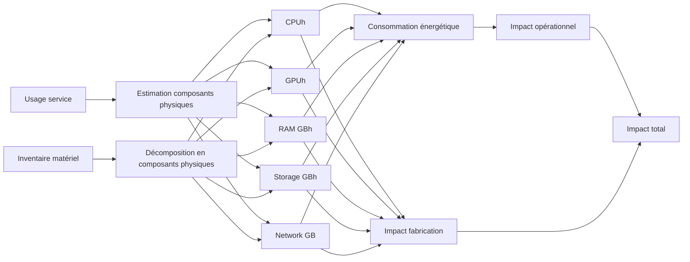

# Méthodologie appliquée aux infrastructures d'hébergement

## Résumé

Cette note méthodologique propose un cadre de calcul pour évaluer l’empreinte environnementale des infrastructures d’hébergement, en distinguant l’empreinte intrinsèque (fabrication, distribution, fin de vie) et l’empreinte opérationnelle (usage).

La démarche suit les principes de l’Analyse de Cycle de Vie (ACV) numérique (ISO 14040-44, ADEME/ARCEP) et vise à fournir une méthode reproductible, transparente et comparable entre différents contextes d’hébergement : on-premise, cloud privé, cloud public.

Elle repose sur un principe simple : relier les infrastructures techniques réellement utilisées (serveurs, stockage, réseau) à leur empreinte environnementale, en s’appuyant soit sur des inventaires physiques disponibles, soit sur la conversion des usages cloud en ressources matérielles équivalentes.

## Principe

La méthodologie repose sur les principes de l’analyse de cycle de vie (ACV) (ISO 14040/44), appliqués aux infrastructures numériques, et se décline en quatre étapes.

Elle débute par l’inventaire des ressources. En on-premise, cela implique le recensement du matériel (serveurs, CPU, RAM, stockage, durée de vie) et sa décomposition en composants. Dans le cloud, les usages (VMs, disques, réseau) sont convertis en ressources matérielles équivalentes nécessaires à la délivrance du service.

Les données sont ensuite normalisées en unités pivot, indépendantes des fournisseurs et des technologies, afin de rendre comparables et consolidables les différents composants.

Vient ensuite le calcul des impacts :

- **Intrinsèques** : fabrication, transport et fin de vie des équipements, répartis sur leur durée de vie.  
- **Opérationnels** : consommation électrique ajustée par le PUE du datacenter et traduite en émissions selon l’intensité carbone locale.  

Enfin, les résultats sont agrégés par périmètre et par fournisseur, afin de constituer l’empreinte globale et d’identifier les leviers de réduction : optimisation des ressources, localisation moins carbonée, ou amélioration du mix énergétique.

## Évaluation des impacts

### Inventaire des ressources on-premise

Pour les environnements on-premise, l’inventaire repose sur la liste des équipements (serveurs, baies de stockage, switchs, routeurs, etc.), généralement issue d’une ou plusieurs CMDB.

Idéalement, ces données incluent le type et le modèle de chaque équipement, ainsi que sa configuration détaillée (nombre et modèle de CPU, capacité mémoire, etc.).

Lorsque ces informations ne sont pas disponibles, des hypothèses doivent être établies à partir de configurations « typiques » ou de matériel générique. Cette approximation reste exploitable, mais réduit la précision et la granularité des évaluations environnementales.

### Inventaires des ressources cloud

Dans une démarche GreenOps, l’inventaire des ressources cloud s’appuie sur les API de facturation mises à disposition par les principaux fournisseurs (AWS, GCP, Azure, etc.), afin de consolider les données d’usage et les coûts associés.

:::note
Chaque fournisseur expose des données similaires, mais dans des formats propres. Le format FOCUS (FinOps Foundation) permet d’homogénéiser ces exports et peut être utilisé lorsqu’aucun connecteur API n’est disponible.
:::

Le niveau de détail fourni sur l’infrastructure matérielle sous-jacente varie selon les services et les fournisseurs. Il est donc nécessaire d’estimer, pour chaque ressource consommée, les composants matériels mobilisés afin d’assurer la délivrance du service.

Le détail de cette inférence des ressources matérielles est présenté dans la section [Inférence du matériel cloud](#inférence-du-matériel-cloud).

### Évaluation des impacts des composants

À l’issue de l’inventaire, chaque composant est identifié avec sa durée d’utilisation. En croisant ces informations avec des référentiels détaillant les caractéristiques des composants et les impacts associés à leur fabrication, il devient possible d’estimer à la fois la consommation énergétique opérationnelle et les impacts liés à la fabrication, répartis sur la durée d’usage.

Le détail des caractéristiques prises en compte et des facteurs appliqués est détaillé dans la section [Evaluation de l'impact du matériel](/).

### Prise en compte des caractéristiques de l'hébergement

Plusieurs caractéristiques sont prises en compte pour sélectionner les facteurs d’émission appropriés et affiner les évaluations :

Localisation géographique du datacenter : le mix énergétique du pays ou de la région influence directement les émissions associées à la consommation électrique.  

- **PUE (Power Usage Effectiveness) du datacenter** : ce coefficient d’efficacité énergétique est appliqué à la consommation de chaque composant pour refléter la consommation réelle, incluant le refroidissement et les infrastructures auxiliaires.  
- **WUE (Water Usage Effectiveness) du datacenter** : ce facteur mesure la quantité d’eau utilisée pour le refroidissement par unité d’énergie consommée. Il permet d’évaluer l’impact en termes de consommation d’eau et de stress hydrique lié à l’exploitation du datacenter.  
- **Durée de vie des équipements** : les impacts de fabrication, transport et fin de vie sont annualisés sur la durée d’usage prévue. Pour le cloud, cette durée est généralement connue seulement de manière globale, et non par composant ou par datacenter.

## Inférence du matériel cloud

### Azure
Les données d'entrées sont récupérées depuis l'API Billing.

| Service | Données d'entrée | Données de sortie |
|---------|------------------|-------------------|
|         |                  |                   |

### AWS
Les données d'entrées sont récupérées depuis les exports Cost and Usage Report ou FOCUS.

| Service | Données d'entrée | Données de sortie |
|---------|------------------|-------------------|
|         |                  |                   |

### GCP
Les données d'entrées sont récupérées depuis les exports Cloud Billing.

| Service | Données d'entrée | Données de sortie |
|---------|------------------|-------------------|
|         |                  |                   |

		

