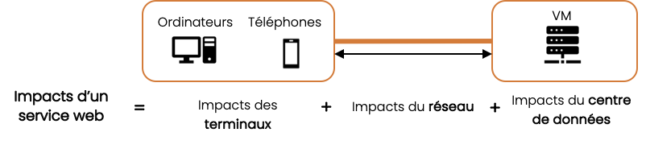

# Méthodologie appliquée aux services web

## Spécificités des services web

### Définition de l’utilisation d’un service web

On peut caractériser une consultation de service web comme tel :
- Un utilisateur peut accéder à une ou plusieurs pages d’un site web, depuis n’importe où dans le monde, une ou plusieurs fois et à partir de différents types de terminaux. 
- Quand l’utilisateur souhaite afficher une page du service, des requêtes sont envoyées via le réseau vers les serveurs qui renvoient les informations, via le réseau, sur le terminal utilisateur. 
- L’utilisateur consulte le contenu des pages pendant un temps variable.

### Périmètre de l’évaluation des impacts

On distingue le cycle de vie d’un service web et le cycle de vie des équipements et infrastructures permettant l’exécution de ce service. Notre méthodologie intègre les impacts de l’ensemble des phases du cycle de vie  des équipements et infrastructures impliqués dans la phase d’utilisation du service web. Les phases de fabrication (conception, développement, validation) et de fin de vie (décommissionnement) du site web ne sont pas pris en compte ici. 

### Approche ACV

L’approche multi-composant énoncée au paragraphe [Approche multi-composants](principles.md#approche-multi-composants) est mise en œuvre en décomposant le service en 3 couches d’équipements et infrastructures numériques impliquées dans l’utilisation d’un service web :
- Terminaux utilisateur final : comprend les équipements utilisés par les utilisateurs pour consulter le service. 
- Réseau : comprend les infrastructures réseau internet pour les échanges de données entre les terminaux des utilisateurs finaux et les centres de données. 
- Datacenters : comprend les équipements liés à l’hébergement et au traitement des données.
     
L’allocation des terminaux et des centres de données est basée sur la durée d’utilisation du service, le réseau sur les octets transférés. Les impacts d’un service web résultent de la somme de ces 3 composantes :

L’évaluation des impacts d’un service web est une agrégation des impacts par page, la méthodologie d’évaluation présentée ici s’applique au niveau d’une page.

### Simulation du nombre de vues par page

L’impact d’un site web est directement lié au nombre de fois où ses pages sont consultées. Le nombre de vues par page est donc un indicateur essentiel pour estimer l’impact du service. Il est récupérable au travers des services d’analyses d’audience qui tracent les interactions du site et existent sur une grande majorité de services.

Dans le cas où le nombre de vues par page n’est pas connu, le nombre de vues total du service est réparti entre les différentes pages du service selon ce qu’on appelle leur « chance de vue », un indice basé sur plusieurs variables caractéristiques de la page (profondeur, nombre de pages « enfants »…). 

À l’aide d’un modèle de régression linéaire et de notre base de données interne, le travail de R&D a permis d’obtenir des coefficients associés à chaque variable. Sur la base de ces coefficients, nous calculons l’ensemble des pourcentages de chance de vue pour chaque page du site web, à l’aide de l’équation suivante

$$
\begin{align*}
&V(p) = 0,26822 \times N - 241,08179 \times dist(p) + 12,89528 \times desc(p) + 160,37288 \times children(p) + 1049,3743 \\
Avec\\
&V(p) = \text{Probabilité de vues de la page}\textit{ p}\\
&N = \text{Nombre total de pages du service numérique}\\
&dist(p) \in \{1,4\} = \text{Distance à parcourir depuis la page d'accueil pour trouver la page}\\
&desc(p) = \text{Nombre de pages descendants de cette page}\\
&children(p) = \text{Nombre de pages enfant de cette page, descendant direct}\\
\end{align*}
$$

Nous réalisons, ensuite, une normalisation des pourcentages de vues au projet selon la formule suivante, nous permettant d’obtenir des pourcentages de vues compris entre 0 et 1. :

$$
\begin{align*}
&V_{norm}(p) = \frac{V(p) - \min\limits_{\forall p' \in P}V(p')}{\max\limits_{\forall p' \in P}V(p') - \min\limits_{\forall p' \in P}V(p')} \\
Avec\\
&V_{norm}(p) = \text{Probabilité normalisée de vues de la page}\textit{ p}\\
&V(p) = \text{Probabilité de vues de la page}\textit{ p}\\
&P = \text{Ensemble des pages du service numérique}\\
\end{align*}
$$

Cependant, une fois cette transformation réalisée, nous faisons face à une seconde difficulté : la somme des pourcentages de vues pour chaque projet n’est pas systématiquement égale à 1. Or, il est nécessaire de répartir l’ensemble des chances de vues entre l’ensemble des pages, et donc avoir une somme des chances de vues qui soit égale à 1.

Pour pallier cette nouvelle difficulté, nous décidons de réaliser une nouvelle normalisation, en divisant chacun des pourcentages de vues (compris entre 0 et 1) par la somme des pourcentages de vues du projet concerné. Cela permet de dispatcher l’ensemble des chances de vues entre les différentes pages, et d’obtenir une somme des chances de vues qui soit égale à 1.

In fine, nous obtenons une chance de vues par page comprise entre 0 et 1, et la somme des chances de vues de l’ensemble des pages de chaque service est égale à 1.

Pour chaque page, en multipliant le résultat final par le nombre de vues totales, on a alors les vues prédites par pages.

## Evaluation des impacts environnementaux d’une page web – Terminal

### Paramètres 

| Nom                  | Définition                                                                                                                                    | Valeur    par défaut                                                                       |
|----------------------|-----------------------------------------------------------------------------------------------------------------------------------------------|--------------------------------------------------------------------------------------------|
| Views                | Nombre de vues de la page, déclinable en en fonction du type de terminal en Views_mobile et Views_desktop                                     | Répartition par page à partir des vues totales (cf. Simulation du nombre de vues par page) |
| UsageDurationPerView | Durée moyenne d’une vue de la page, déclinable en fonction du type de terminal en UsageDurationPerView_mobile et UsageDurationPerView_desktop | Desktop : 69 secondes[^1] Mobile : 34 secondes[^1]                                     |
| RatioMobileUser      | Proportion d’utilisateurs sur mobile par rapport aux utilisateurs totaux                                                                      | 0,59[^3]                                                                                   |
| RatioDesktopUser     | Proportion d’utilisateur sur desktop par rapport aux utilisateurs totaux                                                                      | 1 - RatioMobileUser                                                                        |

[^1]: https://explore.contentsquare.com/digital-experience-benchmark-2023/2023-benchmark-fr
[^3]: https://www.statista.com/statistics/277125/share-of-website-traffic-coming-from-mobile-devices/#:~:text=Mobile%20accounts%20for%20approximately%20half,permanently%20surpassing%20it%20in%202020

### Facteurs d’impacts

Les facteurs fournis par la Base Empreinte font l’objet d’une transformation pour :
- Passer dans des unités de temps à la seconde pour coller aux ordres de grandeur des temps d’utilisation d’un service web
- Obtenir un impact énergie qui prend en compte le temps d’utilisation moyen de chaque typologie d’équipement

Les facteurs sont calculés :
- Par équipement : mobile ou desktop 
- Puis par catégorie d’équipement :
  - Smartphone et tablette pour mobile 
  - Laptop, ordinateur fixe et écran pour le desktop, avec pour chacun une distinction entre un usage professionnel et un usage personnel

Les facteurs par équipement sont obtenus à partir d’une pondération des facteurs de chaque catégorie. Ces coefficients de pondération sont extraits du rapport de l’ADEME/Arcep « Evaluation environnementale des équipements et infrastructures numériques en France, 2ème volet » de janvier 2022.

Le tableau ci-dessous présente les données utilisées pour cette adaptation ainsi que les facteurs obtenus :
- Les facteurs d’impact opérationnels sont à récupérer sur la ligne « Impact énergie en kWh/sec» 
- Les facteurs d’impact intrinsèques sont à récupérer en fonction de l’indicateur environnemental étudié, dans les autres lignes du tableau

<table>
<tbody>
<tr>
<td>

<strong>Equipement</strong>

</td>
<td colspan="3">

<strong>Mobile</strong>

</td>
<td colspan="10">

<strong>Desktop</strong>

</td>
</tr>
<tr>
<td>

<strong>Cat&eacute;gorie</strong>

</td>
<td>

&nbsp;

</td>
<td rowspan="2">

Tablette

</td>
<td rowspan="2">

Smartphone

</td>
<td>

&nbsp;

</td>
<td colspan="3">

Laptop

</td>
<td colspan="3">

Ordinateur fixe (sans &eacute;cran)

</td>
<td colspan="3">

Ecran d'ordinateur

</td>
</tr>
<tr>
<td>

<strong>D&eacute;tail</strong>

</td>
<td>&nbsp;</td>
<td>&nbsp;</td>
<td>&nbsp;</td>
<td>

perso

</td>
<td>

pro

</td>
<td>&nbsp;</td>
<td>

perso

</td>
<td>

pro

</td>
<td>&nbsp;</td>
<td>

perso

</td>
<td>

pro

</td>
</tr>
<tr>
<td>

<strong>R&eacute;partition</strong>

</td>
<td>&nbsp;</td>
<td>

<em>0,1</em>

</td>
<td>

<em>0,9</em>

</td>
<td>&nbsp;</td>
<td>

<em>0,6</em>

</td>
<td>

<em>0,545</em>

</td>
<td>

<em>0,455</em>

</td>
<td>

<em>0,4</em>

</td>
<td>

<em>0,47</em>

</td>
<td>

<em>0,53</em>

</td>
<td>

<em>0,4</em>

</td>
<td>

<em>0,47</em>

</td>
<td>

<em>0,53</em>

</td>
</tr>
<tr>
<td>

<strong>Quantit&eacute; &nbsp;d'&eacute;lectricit&eacute; n&eacute;cessaire pour le proc&eacute;d&eacute; (kWh/an)[^4]</strong>

</td>
<td>&nbsp;</td>
<td>

18,6

</td>
<td>

3,9

</td>
<td>&nbsp;</td>
<td>&nbsp;</td>
<td>

30,96

</td>
<td>

30,96

</td>
<td>&nbsp;</td>
<td>

100

</td>
<td>

151

</td>
<td>&nbsp;</td>
<td>

54

</td>
<td>

54,5

</td>
</tr>
<tr>
<td>

<strong>Temps d&rsquo;utilisation par jour (h/j)</strong>

</td>
<td>&nbsp;</td>
<td>

2,60[^5]

</td>
<td>

3,40[^6]

</td>
<td>&nbsp;</td>
<td>&nbsp;</td>
<td>

3,15[^6]

</td>
<td>

8,00[^7]

</td>
<td>&nbsp;</td>
<td>

3,15[^5]

</td>
<td>

8,00[^6]

</td>
<td>&nbsp;</td>
<td>

3,15[^5]

</td>
<td>

8,00[^6]

</td>
</tr>
<tr>
<td>

<strong>Impact &eacute;nergie en kWh/sec</strong>

</td>
<td>

1,33E-06

</td>
<td>

5,44E-06

</td>
<td>

8,73E-07

</td>
<td>

1,44E-05

</td>
<td>

5,42E-06

</td>
<td>

7,48E-06

</td>
<td>

2,95E-06

</td>
<td>

1,90E-05

</td>
<td>

2,42E-05

</td>
<td>

1,44E-05

</td>
<td>

8,88E-06

</td>
<td>

1,30E-05

</td>
<td>

5,18E-06

</td>
</tr>
<tr>
<td>

<strong>PEF-ADPe (kg SB eq./sec)</strong>

</td>
<td>

2,73E-11

</td>
<td>

3,96E-11

</td>
<td>

2,60E-11

</td>
<td>

7,40E-11

</td>
<td>

5,87E-11

</td>
<td>

5,07E-11

</td>
<td>

6,82E-11

</td>
<td>

4,50E-11

</td>
<td>

4,50E-11

</td>
<td>

4,50E-11

</td>
<td>

5,20E-11

</td>
<td>

5,20E-11

</td>
<td>

5,20E-11

</td>
</tr>
<tr>
<td>

<strong>PEF-AP (mol H+ eq./sec)</strong>

</td>
<td>

5,97E-09

</td>
<td>

4,92E-09

</td>
<td>

6,09E-09

</td>
<td>

8,34E-09

</td>
<td>

7,20E-09

</td>
<td>

6,31E-09

</td>
<td>

8,28E-09

</td>
<td>

8,21E-09

</td>
<td>

8,21E-09

</td>
<td>

8,21E-09

</td>
<td>

1,84E-09

</td>
<td>

1,84E-09

</td>
<td>

1,84E-09

</td>
</tr>
<tr>
<td>

<strong>PEF-CTUe (CTUe/sec)</strong>

</td>
<td>

1,69E-05

</td>
<td>

1,62E-05

</td>
<td>

1,69E-05

</td>
<td>

2,34E-05

</td>
<td>

2,11E-05

</td>
<td>

1,93E-05

</td>
<td>

2,31E-05

</td>
<td>

2,45E-05

</td>
<td>

2,45E-05

</td>
<td>

2,45E-05

</td>
<td>

2,29E-06

</td>
<td>

2,29E-06

</td>
<td>

2,29E-06

</td>
</tr>
<tr>
<td>

<strong>PEF-CTUh-c (CTUh/sec)</strong>

</td>
<td>

2,08E-16

</td>
<td>

1,89E-16

</td>
<td>

2,10E-16

</td>
<td>

1,21E-16

</td>
<td>

3,00E-16

</td>
<td>

2,87E-16

</td>
<td>

3,15E-16

</td>
<td>

-1,50E-16

</td>
<td>

-1,50E-16

</td>
<td>

-1,50E-16

</td>
<td>

2,19E-18

</td>
<td>

2,19E-18

</td>
<td>

2,19E-18

</td>
</tr>
<tr>
<td>

<strong>PEF-CTUh-nc (CTUh/sec)</strong>

</td>
<td>

7,19E-15

</td>
<td>

7,39E-15

</td>
<td>

7,17E-15

</td>
<td>

9,33E-15

</td>
<td>

8,41E-15

</td>
<td>

6,85E-15

</td>
<td>

1,03E-14

</td>
<td>

7,86E-15

</td>
<td>

7,86E-15

</td>
<td>

7,86E-15

</td>
<td>

2,85E-15

</td>
<td>

2,85E-15

</td>
<td>

2,85E-15

</td>
</tr>
<tr>
<td>

<strong>PEF-GWP (kg CO2 eq./sec)</strong>

</td>
<td>

1,04E-06

</td>
<td>

8,02E-07

</td>
<td>

1,07E-06

</td>
<td>

1,46E-06

</td>
<td>

1,26E-06

</td>
<td>

1,11E-06

</td>
<td>

1,44E-06

</td>
<td>

1,46E-06

</td>
<td>

1,46E-06

</td>
<td>

1,46E-06

</td>
<td>

3,11E-07

</td>
<td>

3,11E-07

</td>
<td>

3,11E-07

</td>
</tr>
<tr>
<td>

<strong>PEF-IR (kg U235 eq./sec)</strong>

</td>
<td>

1,90E-07

</td>
<td>

3,42E-07

</td>
<td>

1,73E-07

</td>
<td>

2,43E-06

</td>
<td>

5,26E-07

</td>
<td>

4,79E-07

</td>
<td>

5,83E-07

</td>
<td>

4,60E-06

</td>
<td>

4,60E-06

</td>
<td>

4,60E-06

</td>
<td>

6,94E-07

</td>
<td>

6,94E-07

</td>
<td>

6,94E-07

</td>
</tr>
<tr>
<td>

<strong>PEF-PM (Disease occurrence/sec)</strong>

</td>
<td>

3,36E-14

</td>
<td>

2,77E-14

</td>
<td>

3,42E-14

</td>
<td>

5,05E-14

</td>
<td>

4,22E-14

</td>
<td>

3,71E-14

</td>
<td>

4,82E-14

</td>
<td>

5,07E-14

</td>
<td>

5,07E-14

</td>
<td>

5,07E-14

</td>
<td>

1,23E-14

</td>
<td>

1,23E-14

</td>
<td>

1,23E-14

</td>
</tr>
<tr>
<td>

<strong>PEF-WU (m3 eq./sec)</strong>

</td>
<td>

-1,31E-06

</td>
<td>

-8,94E-07

</td>
<td>

-1,35E-06

</td>
<td>

-1,42E-05

</td>
<td>

-5,76E-06

</td>
<td>

-5,20E-06

</td>
<td>

-6,44E-06

</td>
<td>

-2,38E-05

</td>
<td>

-2,38E-05

</td>
<td>

-2,38E-05

</td>
<td>

-3,08E-06

</td>
<td>

-3,08E-06

</td>
<td>

-3,08E-06

</td>
</tr>
</tbody>
</table>

[^4]:La quantité d'électricité nécessaire pour le procédé et les impacts intrinsèques PEF-ADPe, PEF-AP, PEF-CTUe, PEF-CTUh-c, PEF-CTUh-nc, PEF-GWP, PEF-I, PEF-P, PEF-WU ont été extraits de la base Empreinte ADEME en décembre 2023.
[^5]:Back Flexion and Extension: The Effects of Static Posture on Children Using Mobile Devices, Regina Pope-Ford, January 2019, DOI:10.1007/978-3-319-94589-7_33, In book: Advances in Safety Management and Human Factors (pp.342-351)
[^6]:https://www.comparitech.com/tv-streaming/screen-time-statistics/ consulté en décembre 2023
[^7]:8h par jour estimé sur la base d’une journée de travail type

### Impact intrinsèque du terminal

L’impact intrinsèque du terminal s’évalue avec des facteurs propres à la nature du terminal. On a donc : 

TODO

On calcule EmbodiedImpactXEquipment(mobile) à partir de la formule d’impact intrinsèque d’un équipement, vue au paragraphe [Impact intrinsèque d'un équipement](general.md#impact-intrinsèque-dun-équipement), avec :
- Le facteur d’impact intrinsèque à récupérer dans la colonne « Mobile » du tableau de la page précédente en fonction de l’indicateur environnemental étudié 
- Une durée d’utilisation évaluée à partir des paramètres mobiles  et selon la formule suivante : 

TODO UsageDuration_mobile (s) = Views_mobile (-) *  UsageDurationPerView_mobile (s) * RatioMobileUser (-)

On calcule EmbodiedImpactXEquipment(desktop) à partir de la formule d’impact intrinsèque d’un équipement, vue au paragraphe [Impact intrinsèque d'un équipement](general.md#impact-intrinsèque-dun-équipement), avec :
- Le facteur d’impact intrinsèque à récupérer dans la colonne « Desktop » du tableau de la page précédente en fonction de l’indicateur environnemental étudié 
- Une durée d’utilisation évaluée à partir des paramètres desktop  et selon la formule suivante :
     
TODO UsageDuration_desktop (s) = Views_desktop (-) *  UsageDurationPerView_desktop (s) * RatioDesktopUser (-)

### Impact opérationnel du terminal

La consommation d’électricité du terminal s’évalue avec des facteurs propres à la nature du terminal. On a donc : 

TODO ImpactEnergyTerminal_web =
ImpactEnergyEquipment(mobile) + ImpactEnergyEquipment(desktop)

On calcule ImpactEnergyEquipment(mobile) à partir de la formule de consommation d’électricité d’un équipement vue au paragraphe [Impact opérationnel d'un équipement](general.md#impact-operationnel-dun-équipement), avec :
- Le facteur d’impact opérationnel à récupérer sur la ligne « Impact énergie en kWh/sec» et dans la colonne « Mobile » du tableau de la page précédente 
- La même durée d’utilisation que pour l’impact intrinsèque : UsageDuration_mobile 

On calcule ImpactEnergyEquipment(desktop) à partir de la formule de consommation d’électricité d’un équipement vue au paragraphe [Impact opérationnel d'un équipement](general.md#impact-operationel-dun-équipement), avec :
-	Le facteur d’impact opérationnel à récupérer sur la ligne « Impact énergie en kWh/sec» et dans la colonne « Desktop » du tableau de la page précédente
-	La même durée d’utilisation que pour l’impact intrinsèque : UsageDuration_desktop

La conversion de la consommation électrique en impact opérationnel se fait sur la base de la formule fournie dans le paragraphe [Conversion d’une consommation d’électricité en impact opérationnel](concepts.md#conversion-dune-consommation-délectricité-en-impact-opérationnel).

## Evaluation des impacts environnementaux d’une page web – réseau

### Paramètres

| Nom                   | Définition                                                                                                                                                      | Valeur    par défaut                                                                       |
|-----------------------|-----------------------------------------------------------------------------------------------------------------------------------------------------------------|--------------------------------------------------------------------------------------------|
| Views                 | Nombre de vues de la page, déclinable en en fonction du type de terminal en Views_mobile et Views_desktop                                                       | Répartition par page à partir des vues totales (cf. Simulation du nombre de vues par page) |
| RatioNewVisitor       | Proportion de visiteurs qui effectuent une première visite par rapport aux utilisateurs totaux, déclinable en RatioNewVisitor_Desktop et RatioNewVisitor_Mobile | RatioNewVisitor_Desktop: 0.418[^1] RatioNewVisitor_Mobile: 0.54839[^1]                 |
| RatioReturningVisitor | Proportion de visiteurs récurrents par rapport aux visiteurs totaux                                                                                             | 1 – RatioNewVisitor                                                                        |
| CacheEfficiency       | Ratio des données transférées non rechargées lors d’une deuxième visite                                                                                         |                                                                                            |
| CacheHitRatioCDN      | Présence ou non d’un CDN et hit ratio de celui-ci                                                                                                               | Si pas de CDN CacheHitRatio = 0 Sinon CacheHitRatio = 0.95                             |

### Impact intrinsèque du réseau

L’impact intrinsèque du réseau se calcule en prenant en compte l’effet de cache et les paramètres du réseau étudié :

TODO formule
TODO carte

Cette agrégation prend en compte le hit ratio du CDN s’il en existe un :

TODO formule

### Impact opérationnel du réseau

La consommation électrique du réseau se calcule en prenant en compte l’effet de cache et les paramètres du réseau étudié :

TODO formule
TODO carte

Cette agrégation prend en compte le hit ratio du CDN s’il en existe un :

TODO formule

## Evaluation des impacts environnementaux d’une page web – serveur

### Répartition de l’impact par page

L’impact du centre de donnée est évalué de manière globale, pour l’ensemble du site web $$I_{datacenter}$$. 
Cet impact est ensuite réparti avec le ratio de vues pour chacune des pages ($$V_{page}/V_{total}$$) pour obtenir l’impact de chaque page $$I_{datacenter,page}$$ :

$$
\begin{align*}
&I_{datacenter,page} = I_{datacenter} \times \frac{V_{page}}{V_{total}}\\
Avec \\
&I_{datacenter, page} = \text{Impact du datacenter ramené à la page}\textit{ page }\\
&I_{datacenter} = \text{Impact global du datacenter}\\
&V_{page} = \text{Nombre de vues pour la page}\textit{ page }\\
&V_{total} = \text{Nombre total de vues pour le service}\\
\end{align*}
$$

### Simulation des paramètres serveur

L’utilisation des données et caractéristiques réelles des serveurs est toujours à privilégier par rapport aux méthodes de simulation que nous allons exposer ici.

Dans le cas où les caractéristiques des serveurs ne sont pas connues, mais qu’on dispose d’une volumétrie d’usage par les utilisateurs du site web (temps d’utilisation du service, nombre d’utilisateurs), nous proposons un modèle de corrélation entre l’audience et la quantité de VM nécessaires à la délivrance du service. Les VM ainsi modélisées portent les mêmes caractéristiques que le modèle de machine virtuelle « moyenne » définit par la Base Empreinte.[^42] 

Nous cherchons à obtenir 2 valeurs :

- Le nombre de VM de type "machine virtuelle moyenne" nécessaires pour faire fonctionner le service
- La durée d'utilisation de l'ensemble des VM

Dans la suite de la section, nous prenons l’hypothèse d’une durée d’évaluation d’1 an, c’est-à-dire d’un cas où on cherche à connaître l’impact serveur sur 1 an d’utilisation du site web.

#### Si nous ne disposons d'aucune information sur la durée et la configuration serveur.

Dans un premier temps, nous estimons la durée d’utilisation totale du service $D_{total}$ qui correspond à la durée cumulée de toutes les vues.

L’approche se base sur le principe simple qu’un utilisateur consomme un thread (un vCPU) lorsqu’il utilise le service. Par conséquent, la durée d’utilisation totale du service $D_{total}$ permet d’obtenir la consommation de vCPU nécessaire pour délivrer le service.

:::info[Exemple]
Une durée d’utilisation totale de 200 s correspond à une consommation de 200 vCPU.s pour assurer le service. 
Cette consommation de 200 vCPU.s peut être émise par 1 vCPU pendant 200s ou par 100 vCPU simultanées durant 2s.
:::

À partir de la consommation de vCPU, on en déduit la quantité de VM nécessaires au fonctionnement du service $N_{VM,ideal}$ sur toute la durée d’évaluation, ramenée ici à 1 an :  

$$
\begin{align*}
&N_{VM,ideal} = \frac{D_{usage}}{C_{vCPU} \times D_{total}}\\
Avec \\
&N_{VM,ideal} = \text{Quantité idéale de VM nécessaire pour délivrer le service}\\
&C_{vCPU} = \text{Nombre de vCPU par VM, vaut 8 par défaut pour une VM moyenne}\\
&D_{usage} = \text{Durée d’utilisation annuelle du service}\htmlClass{unit}{[s]}\\
&D_{total} = \text{Durée totale d'une année = 3600} \times 24 \times 365.25\htmlClass{unit}{[s]}\\
\end{align*}
$$

La quantité de VM idéale obtenue n’est pas un nombre entier. Or dans notre modélisation, on cherche à ramener le fonctionnement à une configuration matérielle équivalente réelle. L’équation suivante nous permet d’obtenir le nombre de VM nécessaires pour couvrir le besoin exprimé par la variable $N_{VM,ideal}$ :

$$
\begin{align*}
&N_{VM} = \lceil N_{VM,ideal} \rceil\\
Avec \\
&N_{VM} = \text{Quantité réelle de VM nécessaire pour délivrer le service}\\
&N_{VM,ideal} = \text{Quantité idéale de VM nécessaire pour délivrer le service}\\
\end{align*}
$$

On calcule enfin le temps de fonctionnement moyen de chaque VM sur l’année (serverUptime) en prenant en compte le ratio quantité de VM sur nombre de VM afin de retranscrire le fait que les VM modélisées ne fonctionnent pas en permanence pour le service.  

$$
\begin{align*}
&D_{VM} = D_{total} \times \frac{N_{VM,ideal}}{N_{VM}}\htmlClass{unit}{[s]}\\
Avec \\
&D_{VM} = \text{Durée moyenne de fonctionnement d'une VM sur une année}\htmlClass{unit}{[s]}\\
&D_{total} = \text{Durée totale d'une année = 3600} \times 24 \times 365.25\htmlClass{unit}{[s]}\\
&N_{VM} = \text{Quantité réelle de VM nécessaire pour délivrer le service}\\
&N_{VM,ideal} = \text{Quantité idéale de VM nécessaire pour délivrer le service}\\
\end{align*}
$$

#### Si on connait la durée d’utilisation du serveur

La valeur de la durée d'utilisation serveur (totalServerDuration) est déterminée depuis les analytics ou les données serveurs. Nous déterminons le nombre de VM nécessaires au fonctionnement $N_{VM,ideal}$ à partir de celle-ci et de l'audience du service $D_{total}$.

$$
\begin{align*}
&N_{VM} = \lceil \frac{D_{usage}}{D_{server} \times C_{vCPU}} \rceil\\
Avec \\
&N_{VM} = \text{Quantité réelle de VM nécessaire pour délivrer le service}\\
&D_{usage} = \text{Durée d’utilisation annuelle du service}\htmlClass{unit}{[s]}\\
&D_{server} = \text{Durée d’utilisation annuelle des serveurs}\htmlClass{unit}{[s]}\\
&C_{vCPU} = \text{Nombre de vCPU par VM, vaut 8 par défaut pour une VM moyenne}\\
\end{align*}
$$

[^42]: Configuration : 8 vCPU, 32 GB dedicated RAM, 5 years lifespan

### Impact intrinsèque du centre de données

Les impacts intrinsèques des serveurs reposent sur une approche équipement. Le fait que seuls les impacts des équipements informatiques sont considérés (et pas ceux du centre de donnée dans son ensemble) constitue une limite actuelle de la méthodologie.

On évalue dans un premier temps la somme des impacts des n VM identifiées comme nécessaires au fonctionnement du site web $N_{VM,ideal}$, en distinguant la présence ou non d’un CDN :  

Avec CDN

TODO formule

Sans CDN

TODO formule

### Impact opérationnel du centre de données

Les impacts opérationnels des serveurs reposent sur une estimation de type système. On fait la somme des impacts des n VM $N_{VM,ideal}$ et du LAN pour estimer la consommation d’énergie puis on transforme pour connaitre la consommation d’énergie du centre de données. 

#### Avec CDN

TODO formule

#### Sans CDN

TODO formule

Dans le calcul des variables OperationalImpactXDatacenter, la valeur du REF est basée sur la détection par the greenwebfoundation[^47] d’un hébergement « vert » (REF = 1) ou non (REF = 0).  

[^47]: https://www.thegreenwebfoundation.org/

## Restitutions chiffrées des impacts environnementaux des services web

Les formules présentées précédemment permettent d’obtenir des impacts environnementaux. Elles sont déclinables pour l’évaluation des empreintes environnementales48 mais aussi l’estimation de scores.

Les empreintes correspondent à l’impact réel lié à l’utilisation sur 1 an. On les évalue à l’aide de la méthodologie d’évaluation des impacts environnementaux et avec les données d’usage réelle d’un service, par exemple à l’aide des données récupéré des analytics. Elles sont exprimées dans les unités de mesure propres à l’impact qu’elles caractérisent : gCO2e pour le carbone, L ou m3 pour l’eau… L’empreinte totale d’un service web correspond à la somme des empreintes de chacune de pages.

Les scores s’affichent sous la forme d’un entier entre 0 et 100. Ils sont mis en forme à partir des impacts estimés sur les services web. Leur calcul prend en compte les variables du service, mais aussi certaines hypothèses d’utilisation fixes. L’application de ces critères communs permet d’obtenir un score comparable aux scores d’autres services, et cela quelle que soit la taille ou la fréquentation du site web. On prend comme référence pour tous les services et toutes les pages analysées le cas d’1 nouvelle visite (pas de cache), avec 58% d’utilisateurs à partir de terminaux mobiles et une durée moyenne d’utilisation de 20s. 

Les scores environnementaux du site sont déterminés par une moyenne pondérée des scores par page. La pondération (coefficient de trafic) a pour objectif de prendre en compte l’impact final du site en donnant plus de poids aux pages vues le plus souvent. On applique cette formule :

$$
\begin{align*}
&S_{i} = \frac{\sum_{k=1}^n S_{k,i} \times \alpha_k}{\sum_{k=1}^n \alpha_k}\htmlClass{unit}{[0..100]}\\
Avec \\
&S_{i} = \text{Score global pour l’indicateur environnemental}\textit{ i }\htmlClass{unit}{[0..100]}\\
&S_{k,i} = \text{Score de la page}\textit{ k }\text{pour l’indicateur environnemental}\textit{ i }\htmlClass{unit}{[0..100]}\\
&\alpha_k = \text{Nombre ou chance de vue de la page}\textit{ k }\htmlClass{unit}{> 0}\\
\end{align*}
$$

- **Nombre de vues par page** : Si on dispose du nombre de vues par page, la pondération se base directement sur le nombre de vues par page remonté par un service d'analyse d'audience.
- **Chance de vues par page** : Si on ne connait pas la répartition du nombre de vues sur chacune des pages, la pondération se fait à l’aide de facteurs de « chance de vue » attribués à chacune des pages (Ces facteurs sont déterminés, pour chacune des pages d’un service, conformément aux dispositions du paragraphe [Simulation du nombre de vues par page](#simulation-du-nombre-de-vues-par-page)).
