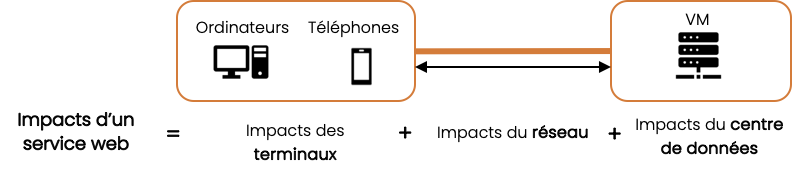

# Méthodologie appliquée aux services web

## Spécificités des services web

### Définition de l’utilisation d’un service web

On peut caractériser une consultation de service web comme tel :
- Un utilisateur peut accéder à une ou plusieurs pages d’un site web, depuis n’importe où dans le monde, une ou plusieurs fois et à partir de différents types de terminaux. 
- Quand l’utilisateur souhaite afficher une page du service, des requêtes sont envoyées via le réseau vers les serveurs qui renvoient les informations, via le réseau, sur le terminal utilisateur. 
- L’utilisateur consulte le contenu des pages pendant un temps variable.

### Périmètre de l’évaluation des impacts

On distingue le cycle de vie d’un service web et le cycle de vie des équipements et infrastructures permettant l’exécution de ce service. Notre méthodologie intègre les impacts de l’ensemble des phases du cycle de vie  des équipements et infrastructures impliqués dans la phase d’utilisation du service web. Les phases de fabrication (conception, développement, validation) et de fin de vie (décommissionnement) du site web ne sont pas pris en compte ici. 

### Approche ACV

L’approche multi-composant énoncée au paragraphe [Approche multi-composants](principles.md#approche-multi-composants) est mise en œuvre en décomposant le service en 3 couches d’équipements et infrastructures numériques impliquées dans l’utilisation d’un service web :
- Terminaux utilisateur final : comprend les équipements utilisés par les utilisateurs pour consulter le service. 
- Réseau : comprend les infrastructures réseau internet pour les échanges de données entre les terminaux des utilisateurs finaux et les centres de données. 
- Datacenters : comprend les équipements liés à l’hébergement et au traitement des données.
     
L’allocation des terminaux et des centres de données est basée sur la durée d’utilisation du service, le réseau sur les octets transférés. Les impacts d’un service web résultent de la somme de ces 3 composantes :

L’évaluation des impacts d’un service web est une agrégation des impacts par page, la méthodologie d’évaluation présentée ici s’applique au niveau d’une page.

### Simulation du nombre de vues par page

L’impact d’un site web est directement lié au nombre de fois où ses pages sont consultées. Le nombre de vues par page est donc un indicateur essentiel pour estimer l’impact du service. Il est récupérable au travers des services d’analyses d’audience qui tracent les interactions du site et existent sur une grande majorité de services.

Dans le cas où le nombre de vues par page n’est pas connu, le nombre de vues total du service est réparti entre les différentes pages du service selon ce qu’on appelle leur « chance de vue », un indice basé sur plusieurs variables caractéristiques de la page (profondeur, nombre de pages « enfants »…). 

A l’aide d’un modèle de régression linéaire et de notre base de données interne, le travail de R&D a permis d’obtenir des coefficients associés à chaque variable. Sur la base de ces coefficients, nous calculons l’ensemble des pourcentages de chance de vue pour chaque page du site web, à l’aide de l’équation suivante

