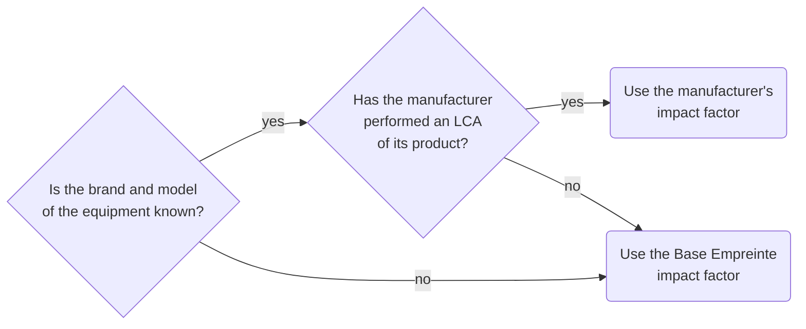

# Methodologies for evaluating environmental impacts

## Environmental impacts of equipment {#impacts-environnementaux-dun-équipement}

### Choosing the environmental impact factor

The factor to consider is determined by the following decision tree, which prioritizes the most discriminating factors:

:::note
This decision tree applies to both embodied impact factors and electricity consumption.
:::

Manufacturer data are not always reliable, and above all not very comparable. The perimeters considered differ, results are not all certified, and methodologies are not always shared. However, we estimate today that manufacturer data provide an estimate closer to our perimeter than the systematic application of generic Base Empreinte factors.

The evolution of available references and better framing of product LCAs could lead us to revisit this choice in the future.

### Embodied impact of equipment {#impact-intrinsèque-dun-équipement}

$$
\begin{align*}
&I_{embodied_{i}} = D_{usage} \times IF_{embodied_{i}}\htmlClass{unit}{[U_i]}\\
Avec\\
&I_{embodied_{i}} = \text{Embodied impact of the equipment for environmental indicator}\textit{ i }\htmlClass{unit}{[U_i]}\\
&D_{usage} = \text{Use duration of the terminal dedicated to the service}\htmlClass{unit}{[s]}\\
&IF_{embodied_{i}} = \text{Embodied impact factor for environmental indicator}\textit{ i }\htmlClass{unit}{[U_i/s]}\\
\end{align*}
$$

:::note
The calculation formula is given in standard units with time in seconds. However, depending on the evaluated process, the same formula should be used with time units other than seconds (months, years, etc.).
:::

Some factors $IF_{embodied_{i}}$ are provided for a reference quantity (for example 1 year) and consider a theoretical lifetime. This may differ from the real lifetime of the equipment studied. A proportionality rule is applied when the real lifetime is known to account for the equipment’s context. Since lifetimes are generally provided in years, the corrected factor $IF_{embodied_{i}}$ is evaluated in x per year according to the formula below, and the embodied impact equation is expressed in years.

$$
\begin{align*}
&IF_{embodied_{i}} = TIF_{embodied_{i}} \times \frac{TL}{RL} \htmlClass{unit}{[U_i/s]}\\
Avec\\
&IF_{embodied_{i}} = \text{Embodied impact factor for environmental indicator}\textit{ i }\htmlClass{unit}{[U_i/s]}\\
&TIF_{embodied_{i}} = \text{Theoretical embodied impact factor for environmental indicator}\textit{ i }\htmlClass{unit}{[U_i/s]}\\
&TL = \text{Theoretical lifetime of the equipment provided by the reference}\htmlClass{unit}{[s]}\\
&RL = \text{Real lifetime of the equipment}\htmlClass{unit}{[s]}\\
\end{align*}
$$

### Operational impact of equipment {#impact-opérationnel-dun-équipement}

Operational impact is evaluated from electricity consumption, which itself is evaluated from usage characteristics according to the following formula:

$$
\begin{align*}
&E_{elec} = D_{usage} \times P_{elec}\htmlClass{unit}{[kWh]}\\
Avec\\
&E_{elec} = \text{Electricity consumption of the equipment}\htmlClass{unit}{[kWh]}\\
&D_{usage} = \text{Use duration of the terminal dedicated to the service}\htmlClass{unit}{[h]}\\
&P_{elec} = \text{Average power of the equipment over the usage period}\htmlClass{unit}{[kW]}\\
\end{align*}
$$

The conversion of electricity consumption into operational impact is based on the formula given in [Converting electricity consumption into operational impact](concepts.md#conversion-dune-consommation-délectricité-en-impact-opérationnel).

## Environmental impacts of the network

Some parts of the network are operated by external operators (WAN, Internet, 4G, etc.), and this externality greatly limits knowledge and control of the equipment involved in the network.

In accordance with the principles laid out by the parent PCR for digital services (see [Equipment approach and system approach](principles.md#approche-équipement-et-approche-système)), the assessment of a network perimeter can use a hardware and/or system approach depending on the level of control of the perimeter or its sub-parts.

### “Equipment” approach for a network

The “equipment” approach is used when the hardware composing the network is known, monitored, and controlled. This approach is generally used to cover internal network perimeters within a site and managed by the organization conducting the assessment.

In this case, the organization inventories and characterizes the equipment that make up its network. The impact of each piece of equipment is evaluated according to [Environmental impacts of equipment](general.md#impacts-environnementaux-dun-équipement).

The total network impact equals the sum of the impacts of each piece of equipment composing the network.

### “System” approach – Case of an external network, WAN type {#approche--système----cas-dun-réseau-externe-type-wan}

The “system” approach is used when the equipment composing the network perimeter studied is unknown. This approach is generally used to cover network perimeters managed by operators. The network perimeter is then assimilated to a closed system for which impact factors are available. This system can be broken down into segments depending on the network typology used (fixed and/or mobile) and the distances covered.

The amount of data transferred by the network (in octets, noted o, or in English in Bytes, noted B, not to be confused with bits, noted b in lowercase) is the input data for this “system” approach, with network allocation based on transferred octets.

#### Specifics of external networks, WAN type

##### Content delivery network (CDN)

When a [CDN](glossary.md#cdn-content-delivery-network) is present in the organization of a network, the embodied impact of associated servers must be taken into account as well as the proportion of data that continues after the CDN to the data center.

A CDN leads to considering that the data flow can be broken down into three segments:
- A segment from the user to the nearest CDN entry point. This first segment is generally within a country.
- A segment from the entry point to the exit point, which is the point closest to the data center. This segment can be international.
- A segment from the exit point to the datacenter. This segment is generally within the country.

Consequently, a CDN is more effective the greater the distance between the user and the data center. It is suited for international transfers, or domestic transfers when the CDN entry and exit points differ.

In addition, a CDN systematically provides a data caching technology from the entry point. As a result, the amount of data circulating is largely reduced between the first segment and the other two, typically on the order of 70% to 90%. The effect is doubly beneficial because it preserves the use of network equipment and reduces the load on data center servers.

##### Geographic scope of networks

Unlike equipment and hosting, the network perimeter physically spans distances that can range from a few meters to several thousand kilometers, potentially crossing several countries.

The proposed methodology integrates a distance factor that adapts the emission factor to the size of the country where digital activities are located and increases impact when the traveled distance is greater. If there is more distance to cover, more equipment will be used and the impact will be higher.

The distance value in km to apply in formulas depends on the segment traveled:

- Case of an internal segment
  - An internal segment corresponds to a network segment present only within a country’s national territory. In the assessment, a distance factor equal to the average distance between the country’s barycenter and its border is applied.
  - This distance relies on estimating a country’s radius $r$ from its surface area $A$, using the formula $r = \sqrt{A/\pi}$. Country surface areas come from an aggregation of several sources compiled in a Wikipedia article.

- Case of an inter-country segment
  - An inter-country segment corresponds to the distance traveled by a network when it leaves a country of origin (user’s country) to connect to a destination country (data center country). In the assessment, a distance factor equal to the average distance between the country of origin and the destination country is applied.
  - The distance is estimated between the barycenters of each country. Barycenter data come from the Google Maps API. Distance estimates are based on the great-circle route between two points A and B on the globe, which is the shortest route between the two points. To calculate this distance, we use the cosine formula from spherical trigonometry: $AB = arccos[sin(la) \times sin(lb) + cos(la) \times cos(lb) \times cos(LB − LB)]$

According to these principles, Digital4Better calculated distance factors by country and by segment type. Data are available as open data on the Digital4Better GitHub.

##### Network typologies (fixed/mobile)

Currently available impact factors distinguish two network typologies: mobile networks (2G, 3G, 4G, 5G) and fixed networks (xDSL, FFTx). The methodology therefore proposes two network typologies to best reflect usage distribution between fixed and mobile networks:
- Mixed networks include both mobile and wired connections.
- Fixed networks include only fixed connections.

##### Environmental impact factors

To implement the two points above (distance factor and fixed/mobile distinction), it is necessary to adjust existing environmental impact factors.

The initial factors are those provided by ADEME’s Base Empreinte in December 2023 (tab “Digital Services,” rows 42 and 43 dedicated to network services):

| Data name                                              | Reference quantity | Unit | Location | Technological description |
|--------------------------------------------------------|--------------------|------|----------|---------------------------|
| Impact of transporting 1 GB of data via fixed network  | 1                  | GB   | France   | Fixed-line network; at consumer; xDSL, FFTx average mix; FR Only equipment located in France is included. Other equipment, such as network equipment used by French players but located elsewhere, is not taken into account. Data come from equipment installation and 2020 energy consumption. |
| Impact of transporting 1 GB of data via mobile network | 1                  | GB   | France   | Mobile network; at consumer; 2G, 3G, 4G, 5G average mix; FR Data come from equipment installation and 2020 energy consumption. |

These factors are estimated for France. To be consistent with our distance-based model, we transformed them to obtain factors per km (division by the estimated radius of France’s territory).

We also integrated the impact of a box on the fixed network, taking into account a volume of 220 GB per month per box.

The results of these adjustments are provided in the table below. For operational impact, data should be taken from the row “Energy impact in kWh/octet/km.” For embodied impact, data should be taken according to the environmental indicator studied, from the other rows of the table.

| Network                                                 | Fixed + Box | _Fixed_     | _Box_       | Mobile     |
|---------------------------------------------------------|------------|-------------|-------------|------------|
| Electricity required for the process (kWh/GB)          | 1.03E-01   | _6.87E-02_  | _3.43E-02_  | 2.36E-01   |
| Energy impact in kWh/octet/km                           | 2.30E-13   |             |             | 5.28E-13   |
| PEF-ADPe (kg SB eq./octet/km)                           | 3.82E-19   | _3.75E-19_  | _7.45E-21_  | 2.41E-18   |
| PEF-AP (mol H+ eq./octet/km)                            | 7.58E-17   | _4.55E-17_  | _3.03E-17_  | 4.51E-17   |
| PEF-CTUe (CTUe/octet/km)                                | -7.08E-14  | _-6.36E-14_ | _-7.23E-15_ | -4.58E-13  |
| PEF-CTUh-c (CTUh/octet/km)                              | 2.83E-23   | _1.21E-23_  | _1.62E-23_  | -1.50E-23  |
| PEF-CTUh-nc (CTUh/octet/km)                             | -2.06E-22  | _-1.50E-22_ | _-5.55E-23_ | -7.70E-22  |
| PEF-GWP (kg CO2 eq./octet/km)                           | 1.60E-14   | _9.89E-15_  | _6.10E-15_  | 1.78E-14   |
| PEF-IR (kg U235 eq./octet/km)                           | 6.18E-14   | _3.91E-14_  | _2.27E-14_  | 7.66E-14   |
| PEF-PM (Disease occurrence/octet/km)                    | 6.07E-22   | _3.93E-22_  | _2.14E-22_  | 6.20E-22   |
| PEF-WU (m3 eq./octet/km)                                | -2.52E-13  | _-1.81E-13_ | _-7.13E-14_ | -9.93E-13  |

In the case of a mixed network (fixed + mobile), the environmental impact factor is a combination of fixed and mobile network factors, taking into account connection and usage characteristics.

The conversion factor for an environmental indicator X is calculated according to the following formula:

$$
\begin{align*}
&CF_{embodied_{i}} = \sum_{e \in \{mobile, desktop\}} P_e \times \left( \sum_{n \in \{fixed, cellular\}} P_{e,n} \times CF_{embodied_{e,n,i}} \right) \htmlClass{unit}{[U_i/o/km]}\\
Avec \\
&CF_{embodied_{i}} = \text{Conversion factor for indicator}\textit{ i }\htmlClass{unit}{[U_i/o/km]}\\
&P_e = \text{Equipment usage share}\textit{ e }\\
&P_{e,n} = \text{Network usage share}\textit{ n }\text{for equipment}\textit{ e }\\
&CF_{embodied_{e,n,i}} = \text{Conversion factor for indicator}\textit{ i }\text{for network}\textit{ n }\text{and equipment}\textit{ e }\htmlClass{unit}{[U_i/o/km]}\\
\end{align*}
$$

This formula also applies in the case of electricity consumption factors for evaluating operational impacts. The values of ImpactXMobileNetwork and ImpactXFixedNetwork should be taken from the row “Electricity required for the process (kWh/GB)” in the factor table.

In the case of a fixed network, the same formula applies but simplifies due to the absence of a mobile network:
- $P_{mobile} = 0$
- $P_{desktop} = 1$
- $P_{desktop,cellular} = 0$

The environmental impact factor is directly equal to the “fixed network” factor provided in the table above.

##### Environmental impact assessment

The WAN network is broken down into one or more segments, themselves composed of mixed and/or fixed networks depending on the nature of the connections.

###### Embodied impact of a network segment

The formula below enables the calculation of the embodied impact of a segment:

$$
\begin{align*}
&SI_{embodied_{i}} = V * L * CF_{embodied_{i}}\htmlClass{unit}{[U_i]}\\
Avec \\
&SI_{embodied_{i}} = \text{Embodied impact of the segment for indicator}\textit{ i }\htmlClass{unit}{[U_i]}\\
&V = \text{Volume of data transferred in the network}\htmlClass{unit}{[o]}\\
&L = \text{Length of the network segment}\htmlClass{unit}{[km]}\\
&CF_{embodied_{i}} = \text{Conversion factor for indicator}\textit{ i }\htmlClass{unit}{[U_i/o/km]}\\
\end{align*}
$$

###### Operational impact of a network segment

The formula below enables the calculation of electricity consumption for data transfer on a network segment:

$$
\begin{align*}
&SE_{elec_n} = V * L * CF_{elec_n}\htmlClass{unit}{[kWh]}\\
Avec \\
&SE_{elec_n} = \text{Electricity consumption of network segment}\textit{ n }\htmlClass{unit}{[kWh]}\\
&V = \text{Volume of data transferred in the network}\htmlClass{unit}{[o]}\\
&L = \text{Length of the network segment}\htmlClass{unit}{[km]}\\
&CF_{elec_n} = \text{Energy conversion factor for network segment}\textit{ n }\htmlClass{unit}{[kWh/o/km]}\\
\end{align*}
$$

The conversion of electricity consumption into operational impact is based on the formula provided in [Converting electricity consumption into operational impact](concepts.md#conversion-dune-consommation-délectricité-en-impact-opérationnel).

###### Total network impact

The network impact is then equal to the sum of impacts per segment:

$$
\begin{align*}
&I_{i} = \sum_{t \in \{operational,embodied\}} \sum_{k=1}^n SI_{t_{k,i}}\htmlClass{unit}{[U_i]}\\
Avec \\
&I_{i} = \text{Impact of the network composed of}\textit{ n }\text{segments for environmental indicator}\textit{ i }\htmlClass{unit}{[U_i]}\\
&SI_{t_{k,i}} = \text{Impact}\textit{ t }\text{of segment}\textit{ k }\text{for environmental indicator}\textit{ i }\htmlClass{unit}{[U_i]}\\
\end{align*}
$$

In accordance with the elements already presented, the network impact of each segment is composed of an embodied impact and an operational impact.

### “System” approach – Case of an internal network, LAN type

A system approach is performed on internal LAN-type networks when the organization does not control the equipment involved. This is the case, for example, when a site’s network is outsourced to a service provider, when the organization shares its network with other organizations, or when accounting for the internal network part of a data center.

#### Embodied impact

The formula below enables the calculation of the embodied impact for transfers on an internal network:

$$
\begin{align*}
&I_{embodied_{i}} = V * CF_{embodied_{i}}\htmlClass{unit}{[U_i]}\\
Avec \\
&I_{embodied_{i}} = \text{Embodied impact of the network for indicator}\textit{ i }\htmlClass{unit}{[U_i]}\\
&V = \text{Volume of data transferred in the network}\htmlClass{unit}{[o]}\\
&CF_{embodied_{i}} = \text{Conversion factor for indicator}\textit{ i }\htmlClass{unit}{[U_i/o]}\\
\end{align*}
$$

:::warning[Limitation]
We do not have a known embodied impact factor to date, so we exclude the assessment of embodied impacts of the LAN network in our evaluations.
:::

#### Operational impact

The formula below enables the calculation of electricity consumption for transfers on an internal network:

$$
\begin{align*}
&E_{elec} = V * CF_{elec}\htmlClass{unit}{[kWh]}\\
Avec \\
&E_{elec} = \text{Electricity consumption of the network}\htmlClass{unit}{[kWh]}\\
&V = \text{Volume of data transferred in the network}\htmlClass{unit}{[o]}\\
&CF_{elec} = \text{Energy conversion factor}\htmlClass{unit}{[kWh/o]}\\
\end{align*}
$$

For an internal network, $CF_{elec}$ is set by default to 0.001 kWh/GB, a value chosen according to the methodology described by Cloud Carbon Footprint.

The conversion of electricity consumption into operational impact is based on the formula given in [Converting electricity consumption into operational impact](concepts.md#conversion-dune-consommation-délectricité-en-impact-opérationnel).

:::warning
The impact factor used here remains experimental and rather oriented toward data centers than organizations.
:::

## Environmental impacts of a data center

### Data center perimeter specifics

A data center is a place where equipment used to organize, store, and process large amounts of data is grouped (servers, storage arrays, network and telecommunications equipment, etc.).

The data center also includes equipment for cooling (air conditioning, etc.), security (fire protection, anti-intrusion devices, etc.), management (workspaces, workshops, etc.), and power supply (PSUs, backup generators) for this equipment.

#### Perimeter of impact assessment

This methodology aims to analyze all or part of a data center, depending on the use case (global infrastructure analysis, web service analysis, etc.).

In the case of a partial analysis, only the equipment necessary to deliver the service is included in the perimeter.

#### Data center energy efficiency

The energy efficiency of a data center is defined by the ratio between the total energy consumed by a data center and the energy actually consumed by the equipment delivering the IT service. This ratio is called [PUE (Power Usage Effectiveness)](glossary.md#pue-power-usage-effectiveness).

$$
\begin{align*}
&PUE = \frac{E_{datacenter}}{E_{servers}}\\
Avec \\
&PUE = \text{Energy efficiency}\\
&E_{datacenter} = \text{Total energy consumed by the data center}\htmlClass{unit}{[kWh]}\\
&E_{servers} = \text{Energy consumed by servers}\htmlClass{unit}{[kWh]}\\
\end{align*}
$$

The closer this ratio is to 1, the more efficient the data center’s energy consumption is.

If the PUE is unknown, we use a default value corresponding to the global average PUE provided by Uptime Institute: 1.58.

#### Renewable energy consumption

Some data centers produce their own energy based on renewable energy production technologies (through photovoltaic panels, hydro power plants, etc.). This renewable energy ratio is often referred to as REF (Renewable Energy Factor).

Some cloud providers include in this REF the share of renewable energy they subscribe to via contracts with “green energy” suppliers in order to consume the most decarbonized energy possible.

#### Accounting for operational impact in the assessment {#prise-en-compte-dans-lévaluation-de-limpact-opérationnel}

When electricity consumption is evaluated from equipment, an additional calculation is required to account for energy consumed by ancillary data center activities and represented by the PUE. This yields the total electricity consumption of the data center:

$$
\begin{align*}
&E_{elec} = E_{usage} \times PUE\htmlClass{unit}{[kWh]}\\
Avec \\
&E_{elec} = \text{Total energy consumed by the data center}\htmlClass{unit}{[kWh]}\\
&E_{usage} = \text{Energy consumed by equipment}\htmlClass{unit}{[kWh]}\\
&PUE = \text{Energy efficiency}\\
\end{align*}
$$

The conversion of electricity consumption into operational impact is based on the formula given in [Converting electricity consumption into operational impact](concepts.md#conversion-dune-consommation-délectricité-en-impact-opérationnel) but with an adjustment to the factor used in order to account for the share of renewable energy consumed by the data center and represented by the REF.

$$
\begin{align*}
&I_{operational_{i,p}} = E_{elec_p} \times (REF \times RIF_{i,p} + (1 - REF) \times IF_{i,p})\htmlClass{unit}{[U_i]}\\
Avec\\
&I_{operational_{i,p}} = \text{Operational impact for environmental indicator}\textit{ i }\text{in country}\textit{ p }\htmlClass{unit}{[U_i]}\\
&E_{elec_p} = \text{Electric energy consumed in country}\textit{ p }\htmlClass{unit}{[kWh]}\\
&IF_{i,p} = \text{Impact factor of indicator}\textit{ i }\text{in country}\textit{ p }\htmlClass{unit}{[U_i/kWh]}\\
&RIF_{i,p} = \text{Renewable energy impact factor of indicator}\textit{ i }\text{in country}\textit{ p }\htmlClass{unit}{[U_i/kWh]}\\
\end{align*}
$$

### “Equipment” approach for a data center

The “equipment” approach is used when the hardware composing the data center is known, monitored, and controlled.

#### Data center embodied impact (equipment approach)

The organization inventories and characterizes the equipment composing the data center. The impact of each piece of equipment is evaluated according to [Environmental impacts of equipment](general.md#impacts-environnementaux-dun-équipement). The total data center impact equals the sum of the embodied impacts of each piece of equipment composing the data center.

#### Data center operational impact (equipment approach)

Electricity consumption is evaluated according to [Environmental impacts of equipment](general.md#impacts-environnementaux-dun-équipement).

The conversion of electricity consumption into operational impact is based on the formula given in [Converting electricity consumption into operational impact](concepts.md#conversion-dune-consommation-délectricité-en-impact-opérationnel).

### “System” approach for a data center

The “system” approach is used when the equipment composing the data center is unknown. The data center is then assimilated to a closed system for which impact factors are available.

In the case of a data center, the available factors are those from Base Empreinte:

| Data name                                                                     | Reference quantity | Unit | Location | Technological description |
|------------------------------------------------------------------------------|--------------------|------|----------|---------------------------|
| Store 1 GB of data in the cloud via a fixed connection for 1 year            | 1                  | GB   | France   | “Cloud storage; 1 GB of data, for 1 year, via a fixed connection, end-user equipment not included; FR” |
| Store 1 GB of data in the cloud via a mobile connection for 1 year           | 1                  | GB   | France   | Impacts account for networks and data centers of end users. They are an average configuration. |
| Store 1 GB of data in the cloud via a fixed connection for 10 years          | 1                  | GB   | France   | Datacenter block + emitter storage: Netflix technical performance; PUE = 1.3 |
| Store 1 GB of data in the cloud via a mobile connection for 10 years         | 1                  | GB   | France   | Lifetime: firewall 5 years, switch 5 years, router 5 years, server 5 years, storage 5 years, support equipment and architecture 25 years |

These factors have several limitations:
- They concern only French territory.
- They concern only data storage and not processing.
- They are available for fixed storage durations.

Given these elements, we recommend a complementary approach focused on equipment components, for which organizations more easily have information.

### “Component” approach for a data center

If the inventory of physical equipment used in a data center is not known, but the quantity of “unit” components (CPU, RAM, storage, and network) used is known, then the assessment is carried out as follows.

#### Data center embodied impact

Our embodied impact approach takes into account only the impact linked to the IT infrastructures of the data center.

The best approach to evaluate impacts linked to the IT infrastructures of a data center is equivalent to applying the “equipment” approach at the component level (RAM, CPU, etc.) rather than the equipment model level (servers). However, we do not currently have easily accessible and free factors to implement this approach.

To assess the impacts of IT equipment, it is therefore necessary to go back to the equipment level. There are two possibilities for this step:
- Match configurations made up of components to server models. Cloud Carbon Footprint provides an open-access database called Cloud Carbon Coefficients. The main limitations of this solution are the absence of multi-criteria factors (only GHG impact is provided) and the focus on “cloud” servers.
- Use generic Base Empreinte factors on virtual machines, whose main limitation is that only three configurations are available:

| Category                   | Data name (French)                                                                                                                       | Reference quantity | Unit | Location | Equipment lifetime (years) | Technological description |
|---------------------------|-------------------------------------------------------------------------------------------------------------------------------------------|--------------------|------|----------|----------------------------|---------------------------|
| Virtual machine - Small   | Average impact of a small virtual machine, including manufacturing, transport, and end of life, reported to one year of use              | 1                  | year | Asia     | 5                          | Configuration: virtual machine; use mix; average configuration: 1 vCPU, 4 GB dedicated RAM, 5-year lifespan; RAS. Impacts account for all life cycle stages (cradle-to-grave inventory). Technical configuration based on APL datacenter numbers. |
| Virtual machine - Medium  | Average impact of a virtual machine, including manufacturing, transport, and end of life, reported to one year of use                    | 1                  | year | Asia     | 5                          | Configuration: virtual machine; use mix; average configuration: 8 vCPU, 32 GB dedicated RAM, 5-year lifespan; RAS. Impacts account for all life cycle stages (cradle-to-grave inventory). Technical configuration based on APL datacenter numbers. |
| Virtual machine - Large   | Average impact of a large virtual machine, including manufacturing, transport, and end of life, reported to one year of use              | 1                  | year | Asia     | 5                          | Configuration: virtual machine; use mix; average configuration: 48 vCPU, 192 GB dedicated RAM, 5-year lifespan; RAS. Impacts account for all life cycle stages (cradle-to-grave inventory). Technical configuration based on APL datacenter numbers. |

Once the impact factor is determined, the formulas presented in [Environmental impacts of equipment](general.md#impacts-environnementaux-dun-équipement) are applied. The total embodied impact equals the sum of the embodied impacts of each server identified to cover all components constituting the data center and ideally the internal LAN network (a limitation today because it is not taken into account in our model).

:::note
We consider a vCPU as a thread of a physical CPU. For example, 8 vCPUs correspond to a 4-core hyperthreaded processor.
:::

#### Data center operational impact

Operational impact is based on calculation formulas and coefficients from Cloud Jewels.

$$
\begin{align*}
&E_{datacenter} = E_{components} + E_{network}\htmlClass{unit}{[kWh]}\\
Avec\\
&E_{datacenter} = \text{Electricity consumption of IT equipment}\htmlClass{unit}{[kWh]}\\
&E_{components} = \text{Electricity consumption of storage and processing equipment}\htmlClass{unit}{[kWh]}\\
&E_{network} = \text{Electricity consumption of network equipment}\htmlClass{unit}{[kWh]}\\
\end{align*}
$$

Electricity consumption associated with storage and processing equipment is calculated by separating equipment into several types of components:

$$
\begin{align*}
&E_{components} = D_{usage} \times (P_{cpu} + P_{gpu} + P_{ram} + P_{storage})\htmlClass{unit}{[kWh]}\\
Avec\\
&E_{components} = \text{Electricity consumption of storage and processing equipment}\htmlClass{unit}{[kWh]}\\
&D_{usage} = \text{Equipment usage duration}\htmlClass{unit}{[h]}\\
&P_{cpu} = N_{vcpu} \times (P_{cpu_{min}} + \frac{1}{2} \times (P_{cpu_{max}} - P_{cpu_{min}}))\htmlClass{unit}{[kW]}\\
&P_{gpu} = N_{gpu} \times (P_{gpu_{min}} + \frac{1}{2} \times (P_{gpu_{max}} - P_{gpu_{min}}))\htmlClass{unit}{[kW]}\\
&P_{ram} = N_{ram} \times 0,000392\htmlClass{unit}{[kW]}\\
&P_{storage} = \begin{cases}
1,2\cdot10^{-3} \times V_{storage} &\text{if SSD storage} \\
0,65\cdot10^{-3} \times V_{storage} &\text{if HDD storage}
\end{cases}
\htmlClass{unit}{[kW]}\\
&N_{vcpu} = \text{Number of vCPU of the equipment} \\
&P_{cpu_{min}} = \text{Minimum vCPU power}\htmlClass{unit}{[kW]}\\
&P_{cpu_{max}} = \text{Maximum vCPU power}\htmlClass{unit}{[kW]}\\
&N_{gpu} = \text{Number of GPU of the equipment} \\
&P_{gpu_{min}} = \text{Minimum GPU power}\htmlClass{unit}{[kW]}\\
&P_{gpu_{max}} = \text{Maximum GPU power}\htmlClass{unit}{[kW]}\\
&N_{ram} = \text{Amount of RAM of the equipment}\htmlClass{unit}{[GB]}\\
&V_{storage} = \text{Storage volume of the equipment}\htmlClass{unit}{[TB]}\\
\end{align*}
$$

The estimate of total data center electricity consumption is based on the formula given in [Accounting for operational impact in the assessment](#prise-en-compte-dans-lévaluation-de-limpact-opérationnel), and the conversion of electricity consumption into operational impact is based on the formula given in [Converting electricity consumption into operational impact](concepts.md#conversion-dune-consommation-délectricité-en-impact-opérationnel).
