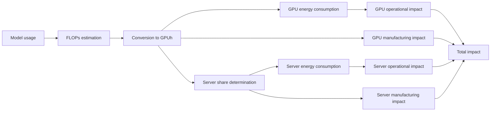

# Methodology applied to generative AI

## Summary

This methodological note proposes a calculation framework to assess the environmental footprint of generative AI models by integrating training, fine-tuning, and inference. The approach is based on estimating the compute load (FLOPs) required by each usage, converting it into GPU usage time, then into energy consumption and greenhouse gas (GHG) emissions. It also includes the share of impact linked to equipment manufacturing and life cycle. This approach aims to provide a reproducible, transparent method adapted to different models and usage contexts, consistent with Green AI research recommendations.

## Principle

The methodology is based on a simple philosophy: directly link real uses of an AI model (training, fine-tuning, inference) to the hardware footprint necessary to perform them.

Rather than starting from global electricity consumption measurements at the data center level, which are often inaccessible or proprietary (Google, 2025), it first evaluates the amount of computation required by the model according to:

- its own characteristics (size, number of parameters, proportion of activated parameters, architecture),
- the volume of tokens consumed or generated (text, images, etc.).

This compute load is expressed in FLOPs, then converted to effective hardware usage time (GPUh) while accounting for real efficiency (Model FLOP Utilization, MFU).

The next step translates this usage time into energy consumption and GHG emissions based on the physical characteristics of GPUs/servers and operating conditions (PUE, electricity emission factor).

Finally, a share of the impact related to manufacturing and the equipment life cycle is added proportionally to usage time, following a life-cycle assessment (LCA) logic (ISO 14040 and 14044).

:::note[Why use FLOPs as a metric?]
According to the Green AI study, FLOPs are a relevant metric to measure the impact of generative AI because they express the compute load actually performed, directly correlated with energy consumption, and provide a hardware-agnostic basis to compare different models fairly.
:::

## Impact assessment

### Estimating compute load

| Use case                                        | Calculation formula                                                                                              | Variables                                                                                                                                                                                                                                          | Explanation                                                                                                                                                                                                                                                                                      |
|------------------------------------------------|------------------------------------------------------------------------------------------------------------------|----------------------------------------------------------------------------------------------------------------------------------------------------------------------------------------------------------------------------------------------------|--------------------------------------------------------------------------------------------------------------------------------------------------------------------------------------------------------------------------------------------------------------------------------------------------|
| **Training**                                   | $FLOP \approx 6 \times P_\text{total} \times T_\text{training}$                                              | $P_{total}$: total number of model parameters $T_{training}$: number of tokens processed during training (tokens × batch × steps)                                                                                                             | For each token and parameter, 6 FLOPs are needed: 2 FLOPs for the forward pass and 4 for gradient computation and propagation (Source: Scaling Law, Transformers FLOPs, Transformers Inference Arithmetic)                                                                                         |
| **Fine-tuning**                                | $FLOP \approx (2 \times P_\text{total} + 4 \times P_\text{tunable}) \times T_\text{training}$               | $P_{total}$: total number of model parameters $P_{tunable}$: number of trainable parameters (depends on optimization: LoRA, …) $T_{training}$: number of tokens processed during training (tokens × batch × steps)                         | Same as full training, however the number of updated parameters is lower (Source: Scaling Law, Transformers FLOPs, Transformers Inference Arithmetic)                                                                                                                                            |
| **Prompt processing**                          | $FLOP \approx 1 \times P_{active} \times T_{input}$                                                            | $P_{active}$: number of active parameters $T_{input}$: number of prompt tokens                                                                                                                                                                 | With KV cache enabled, the prompt is encoded once: cost is reduced to ≈ 1 FLOP per parameter/token (Source: Scaling Law, Transformers FLOPs, Transformers Inference Arithmetic)                                                                                                                |
| **Text generation**                            | $FLOP \approx 2 \times P_\text{active} \times T_\text{output}$                                                | $P_{active}$: number of active parameters $T_{output}$: number of generated tokens                                                                                                                                                              | For each token and parameter, 2 FLOPs are needed for the forward pass. The number of active parameters during inference depends on the model architecture (especially for MoE). (Source: Scaling Law, Transformers FLOPs, Transformers Inference Arithmetic)                                         |
| **Image generation**                           | $FLOP \approx 2 \times P_\text{active} \times N_\text{activation}$                                            | $N_{activation}$: number of activations = width x height x number of channels                                                                                                                                                                      | For each activation and parameter, 2 FLOPs are needed for the forward pass (Source: Clockwork Diffusion, Transformers Inference Arithmetic)                                                                                                                                                      |
| **Video generation** (frame by frame)      | $FLOP \approx 2 \times P_\text{active} \times N_\text{activation} \times F$                                   | $N_{activation}$: number of activations = width x height x number of channels $F$: number of frames to generate                                                                                                                                 | Generation processes each frame independently (Source: Clockwork Diffusion, Transformers Inference Arithmetic)                                                                                                                                                                                  |
| **Video generation** (spatio-temporal)     | $FLOP \approx 2 \times P_\text{active} \times N_\text{activation} \times F + 2 \times (F \times S)^2 \times d$ | $N_{activation}$: number of activations = width x height x number of channels $F$: number of frames to generate $S$: number of spatial tokens = width x height $D$: latent dimension = number of channels $d$: hidden dimension | The first term corresponds to the linear cost of frame generation. The second models the dominant quadratic cost of spatio-temporal self-attention across all video tokens. (Source: Video Killed the Energy Budget)                                                                            |

### Conversion to GPU usage

If the FLOP processing capacity of a GPU is known, it is then trivial to calculate the theoretical usage duration to satisfy one of the above use cases:

$$$D_{gpu} = \frac{FLOP}{(C_{gpu}\times MFU)}$$$

With $D_{gpu}$ the GPU usage duration in hours, and $C_{gpu}$ the theoretical computing capacity in FLOP/h of the GPU.

The actually usable computing capacity of a GPU, taking into account model typology, GPU/TPU type, heavy parallelism, network exchanges, etc., would represent only 25 to 50% of the theoretical capacity (see NVIDIA Benchmarks).

This utilization rate is called $MFU$ (Model FLOP Utilization).

### Conversion to energy consumption

If we assume that during GPU usage its energy consumption is at maximum, the calculation of its energy consumption is simple:

$$$E_{gpu} = D_{gpu} \times P_{gpu}$$$

With $P_{gpu}$ the GPU power in Watts.

In a data center context, it is relevant to multiply this figure by its $PUE$ (Power Usage Efficiency) to account for energy efficiency.

### Environmental impact of energy consumption

To obtain the environmental impact (e.g., GHG emissions) of energy, simply apply electricity emission factors such as those available in the D4B Open Data reference:

$$$I_{operational} = E_{gpu} \times F_{energy}$$$

### Environmental impact of GPU manufacturing

The impact linked to GPU manufacturing is calculated proportionally to usage duration relative to the estimated GPU lifetime:

$$$I_{embodied} = I_{manufacturing} \times \frac{D_{usage}}{D_{lifespan}}$$$

### Accounting for server impacts

The impact of other components (CPU, RAM, storage, chassis) is also taken into account. Because durations are expressed in GPUh, the impact of these components is allocated in proportion to the number of GPUs per server. For example, in an 8-GPU server, one eighth of the operational and embodied impacts of non-GPU components is attributed to each calculated GPUh.

$$$I_{total} = I_{gpu} + \frac{I_{server}}{N_{gpu/server}}$$$

## Assumptions & limits

### Assumptions

- During inference, a cache (KV) is always present (Transformer Inference Arithmetic).
- Electricity emission factors come from the D4B Open Data reference.

### Limitations

- Uncertainties in input data: actual training data, model characteristics often confidential, MFU, etc.
- No accounting for whether models fit in memory on selected hardware.
- No handling of TPU, FPGA, ASIC specificities.
- No reliable LCA on equipment.

### Perspectives

- Include public metrics such as tokens/s in addition to FLOPs.
- Account for precision (FP32, FP16, ...).
- Integrate overhead to account for parallelism impacts (network, replication, queuing, ...).
- Integrate GPU memory as a bottleneck.
- Integrate amortization of training across inference.
- Adapt MFU according to server characteristics (number of GPUs per server, ...).
- Adapt the methodology to multimodal models (text, image, video).
- Integrate multi-criteria impact factors (primary energy, water, rare metals).
- Integrate training of development versions attributable to the current model version.

## Application

This section aims to evaluate the model using public data from the open-source LLM Llama 3.1 (405B parameters).

### Hardware assumptions

The NVIDIA DGX H100 is a “classic” configuration on which the workloads are executed.

| Characteristics        | Component                                                   | Power                | Life-cycle impact (approximate)           |
|------------------------|-------------------------------------------------------------|----------------------|-------------------------------------------|
| CPU                    | 2 x Intel Xeon Platinum 8480C processors (112 cores total) | 2 x 350 = 700 W      | 2 x 25 = 50 kgCO2e                         |
| RAM                    | 2 TB                                                        | 2 x 1024 x 0.392 = 803 W  | 2 x 1024 x 533 / 384 = 2843 kgCO2e     |
| Storage                | 30 TB SSD                                                   | 30 x 1024 x 0.0012 = 37 W | 30 x 1024 x 0.16 = 4915 kgCO2e         |
| GPU                    | 8 x H100 80 GB (989 TFLOP/s per GPU)                        | 8 x 700 W            | 8 x 250 kgCO2e                             |
| Chassis                |                                                             | -                    | 250 kgCO2e                                 |
| Total (excluding GPU)  |                                                             | 1540 W               | 10058 kgCO2e                               |
| Total (excluding GPU)/h|                                                             | 1540 W               | 10058 / (5 x 24 x 365.25) = 0.230 kgCO2e/h |

### Training impact

Llama 3.1 (405B parameters) was trained with approximately 15 trillion (15e12) tokens.
According to Huggingface, it was trained with 24576 H100 GPUs:
Training Time (GPU hours)    Power Consumption (W)    Emissions (tons CO2eq)
Llama 3.1 8B    1.46M    700    420
Llama 3.1 70B   7.0M     700    2,040
Llama 3.1 405B  30.84M   700    8,930

According to the model formulas and assuming an MFU of 40% (to be refined based on NVIDIA benchmarks, it could be closer to 35%) for training, a PUE of 1.2 and a GHG emission factor of 0.420 kgCO2e / kWh:

$$$
\begin{aligned}
&FLOP_{training} = 6 \times P_{total} \times T_{training} = 6 \times 405e9 \times 15e12 = 3.65e25 FLOP \\
&D_{training} = \frac{FLOP_{training}}{FLOP_{gpu} \times MFU} = \frac{FLOP_{training}}{989e12 * 3600 \times 0.40} = 25.6e6 GPU.h \\
&E_{training} = 0.700 \times D_{training} \times PUE = 21.5e6 kWh \\
&I^{gpu}_{training_{ope}} = 0.420 \times E_{training} = 9,030 tCO2e \\
\end{aligned}
$$$

:::note
The gap between Huggingface data and the calculation is < 2%, which remains very reasonable.
:::

For embodied impact, we assume a 5-year equipment lifetime:

$I^{gpu}_{training_{emb}} = \frac{D_{training}}{D_{lifespan}} \times I_{total_{emb}} = \frac{25.6e6}{(5 \times 24 \times 365.25)} \times 250 = 146 tCO2e$

:::note
We observe that embodied impact is considerably lower than operational impact.
:::

To GPU impact we add server operational and embodied impact. There are 8 GPUs per server, so we add 1/8 of non-GPU components.

$$$
\begin{aligned}
&I_{training_{ope}} = I^{gpu}_{training_{ope}} + \frac{I^{server}_{training_{ope}}}{8} = 9030 + \frac{25.6e6 \times 1.540 \times 0.420 \times 1.2 }{8} = 11,513 tCO2e \\
&I_{training_{emb}} = I^{gpu}_{training_{emb}} + \frac{I^{server}_{training_{emb}}}{8} = 146 + \frac{25.6e6 \times 0.000230}{8} = 899 tCO2e
\end{aligned}
$$$

### Impact of generating 1 million tokens

In the cloud, when using an LLM in “completion” mode, thanks to KV caching, input tokens only incur a linear cost per output token because attention is recalculated only on newly generated tokens.

$$$
\begin{aligned}
&I^{gpu}_{output_{ope}} = \frac{2 \times 405e9 \times 1e6}{989e12 \times 3600 \times 0.40} \times (0.700 + \frac{1.540}{8}) \times 1.2 \times 0.420 = 256gCO2e \\
&I^{gpu}_{output_{emb}} = \frac{2 \times 405e9 \times 1e6}{989e12 \times 3600 \times 0.40} \times \frac{250 + \frac{10058}{8}}{5\times24\times365.25} = 20gCO2e
\end{aligned}
$$$

If we consider an average prompt size of about 400 tokens, then the impact of a request is about 0.1 gCO2e.

## Simulator

import { AIPlayGround } from '@site/src/components/ai-playground';

<AIPlayGround />

## Comparison

This section provides a comparison of available methodologies for evaluating the environmental impacts of generative AI models. It highlights their perimeters, strengths, and limitations, to position the D4B methodology relative to existing approaches.

| Characteristic                                            | Full LCA (Google, 2025)                                                                                         | Ecologits                                                                           | D4B methodology                                                                    |
|-----------------------------------------------------------|------------------------------------------------------------------------------------------------------------------|-------------------------------------------------------------------------------------|-----------------------------------------------------------------------------------|
| Approach type                                              | Full-stack measurement: CPU/DRAM, idle machines, datacenter overhead, water, partial hardware LCA               | Bottom-up assessment applied to inference only (usage + manufacturing)             | FLOPs → GPUh → impacts modeling                                                    |
| Perimeter                                                  | Manufacturing (partial), usage (all server components), datacenter infrastructure, water, Scope 2/3 emissions | Infra usage + manufacturing, inference only                                        | Training, fine-tuning, inference usage + GPU and server manufacturing             |
| Granularity & measurement                                  | Very fine: real measurements on Gemini production, energy, water, emissions                                     | Medium-high, open data multi-criteria (GWP, PE, ADPe) aggregated per API call       | Moderate: depends on available data (FLOPs, TDP, ...)                             |
| Accessibility                                              | Low: internal Google data not detailed                                                                           | High: open-source code, open API                                                   | High: publicly documented methods and assumptions                                 |
| Reproducibility                                            | Low: proprietary instrumentation and internal data                                                                | High: public tool, transparent and reproducible calculations                       | Medium to high: if input data can be estimated                                    |
| Transparency                                               | Medium: method published but data access limited                                                                  | High: open-source code, assumptions, and model                                     | High: all formulas and sources are explained                                      |
| Accuracy (inference)                                       | Very high: real measured deployment, includes full energy spectrum                                                | Medium: relies on simplified models and generalized assumptions                    | Medium to high depending on parameter accuracy                                   |
| Applicability                                              | Limited: specific to Google infrastructure and inference                                                          | Medium: inference across various providers, but no training                        | Very broad: training, fine-tuning, inference based on public data                 |
| Targeted uses                                              | Internal analysis, detailed reporting, communication                                                              | Public assessment, awareness, multi-provider comparison                            | Research, internal assessment, FinOps, Green AI                                   |
| Quantified results (Average prompt, around 400 tokens) | ~0.03 gCO2e ~0.24 Wh Gemini                                                                              | ~40 gCO2e ~95 Wh Llama 3.1 405b                                             | ~0.12 gCO2e ~0.27 Wh Llama 3.1 405b (see [Application](#application))  |
| Key limitations                                            | Proprietary data, does not cover training, focuses on inference, bias on “median prompt”                        | Limited perimeter (inference only), possible overestimation due to extrapolation   | Highly dependent on assumptions (MFU, lifetime)                                  |

These results show that each approach has a specific positioning: Google prioritizes accuracy but remains closed and non-reproducible, Ecologits focuses on transparency and simplicity but at the cost of possible overestimation, while the D4B methodology offers a reproducible and adaptable compromise for different usage contexts but depends on the precision of input data.

[^1]: J. Kaplan, S. McCandlish, ..., 2020. Scaling Laws for Neural Language Models
[^2]: A. Habibian, A. Ghodrati, ... 2024. Clockwork Diffusion: Efficient Generation With Model-Step Distillation
[^3]: Google, 2025. Measuring the environmental impact of delivering AI at Google Scale
[^4]: Google, 2025. Life-Cycle Emissions of AI Hardware: A Cradle-To-Grave Approach and Generational Trends
[^5]: J. You, 2025. How much energy ChatGPT use
[^6]: A. Casson, 2023. Transformer FLOPs
[^7]: D. Bahdanau, 2022. The FLOPs Calculus of Language Model Training
[^8]: C. Chen, 2023. Transformer Inference Arithmetic
[^9]: Huggingface, 2022. Understanding FLOPs-per-token estimates from OpenAI’s scaling laws
[^10]: D. Patterson, 2022. The Carbon Footprint of Machine Learning Training Will Plateau, Then Shrink
[^11]: Google, 2022. PaLM: Scaling Language Modeling with Pathways
[^12]: Meta, 2024. The Llama 3 Herd of Models
[^13]: NVidia, 2025. Llama 3.1 70B 24.11.1 (DGXC Benchmarking)
[^14]: GenAI Impact. EcoLogits
[^15]: Schwartz et al., 2020, Henderson et al., 2020. Green AI
[^16]: Edward Hu, 2021. LoRA, Low-rank Adaptation of LLMs
[^17]: Julien Delavande, Regis Pierrard, 2025. Video Killed the Energy Budget: Characterizing the Latency and Power Regimes of Open Text-to-Video Models
