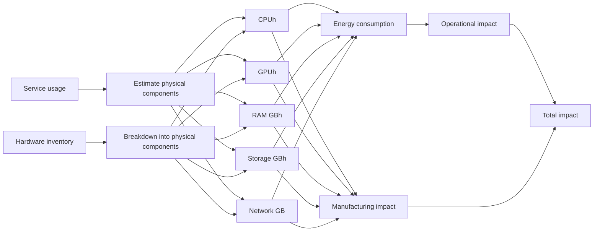

# Methodology applied to hosting infrastructures

## Summary

This methodological note proposes a calculation framework to assess the environmental footprint of hosting infrastructures by distinguishing embodied footprint (manufacturing, distribution, end of life) and operational footprint (use).

The approach follows the principles of digital Life Cycle Assessment (LCA) (ISO 14040-44, ADEME/ARCEP) and aims to provide a reproducible, transparent, and comparable method across different hosting contexts: on-premise, private cloud, public cloud.

It is based on a simple principle: link the technical infrastructures actually used (servers, storage, network) to their environmental footprint, relying either on available physical inventories or on converting cloud usage into equivalent hardware resources.

## Principle

The methodology is based on life cycle assessment (LCA) principles (ISO 14040/44) applied to digital infrastructures, and is broken down into four steps.

It starts with an inventory of resources. On-premise, this involves listing hardware (servers, CPUs, RAM, storage, lifetimes) and breaking it down into components. In the cloud, usages (VMs, disks, network) are converted into equivalent hardware resources needed to deliver the service.

Data are then normalized into pivot units, independent of providers and technologies, to make different components comparable and consolidable.

Next comes the impact calculation:

- **Embodied**: manufacturing, transport, and end-of-life of equipment, allocated over their lifetime.
- **Operational**: electricity consumption adjusted by the data center PUE and translated into emissions according to local carbon intensity.

Finally, results are aggregated by perimeter and provider to constitute the overall footprint and identify reduction levers: resource optimization, less carbon-intensive locations, or improved energy mix.

## Impact assessment

### On-premise resource inventory

For on-premise environments, the inventory is based on the list of equipment (servers, storage arrays, switches, routers, etc.), generally sourced from one or more CMDBs.

Ideally, these data include the type and model of each piece of equipment, as well as detailed configuration (number and model of CPUs, memory capacity, etc.).

When this information is not available, assumptions must be established from “typical” configurations or generic equipment. This approximation remains usable but reduces the precision and granularity of environmental assessments.

### Cloud resource inventories

In a GreenOps approach, the inventory of cloud resources relies on billing APIs provided by major vendors (AWS, GCP, Azure, etc.) to consolidate usage data and associated costs.

:::note
Each provider exposes similar data, but in proprietary formats. The FOCUS format (FinOps Foundation) helps standardize these exports and can be used when no API connector is available.
:::

The level of detail provided about underlying hardware infrastructure varies by service and provider. It is therefore necessary to estimate, for each consumed resource, the hardware components mobilized to deliver the service.

Details of this inference of hardware resources are presented in the section [Cloud hardware inference](#inférence-du-matériel-cloud).

### Assessing component impacts

After the inventory, each component is identified with its usage duration. By combining this information with references detailing component characteristics and impacts associated with their manufacturing, it becomes possible to estimate both operational energy consumption and manufacturing impacts allocated over the usage duration.

Details of the characteristics considered and factors applied are described in [Hardware impact assessment](/).

### Accounting for hosting characteristics

Several characteristics are considered to select appropriate emission factors and refine assessments:

Geographic location of the data center: the energy mix of the country or region directly influences emissions associated with electricity consumption.

- **Data center PUE (Power Usage Effectiveness)**: this energy efficiency coefficient is applied to each component’s consumption to reflect real consumption, including cooling and auxiliary infrastructure.
- **Data center WUE (Water Usage Effectiveness)**: this factor measures the amount of water used for cooling per unit of energy consumed. It helps assess impact in terms of water consumption and water stress linked to data center operation.
- **Equipment lifetime**: manufacturing, transport, and end-of-life impacts are annualized over the planned usage duration. For cloud, this lifetime is generally known only globally, not by component or by data center.

## Cloud hardware inference {#inférence-du-matériel-cloud}

### Azure
Input data are retrieved from the Billing API.

| Service | Input data | Output data |
|---------|------------|-------------|
|         |            |             |

### AWS
Input data are retrieved from Cost and Usage Report or FOCUS exports.

| Service | Input data | Output data |
|---------|------------|-------------|
|         |            |             |

### GCP
Input data are retrieved from Cloud Billing exports.

| Service | Input data | Output data |
|---------|------------|-------------|
|         |            |             |
