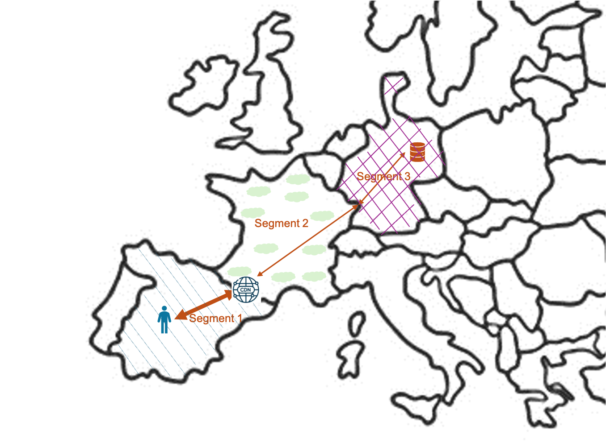

# Methodology applied to web services

## Specifics of web services

### Definition of using a web service

A web service visit can be characterized as follows:
- A user can access one or more pages of a website, from anywhere in the world, one or more times and from different types of devices.
- When the user wants to display a page of the service, requests are sent over the network to the servers which return the information, over the network, to the user’s device.
- The user reads the page content for a variable amount of time.

### Impact assessment perimeter

We distinguish the life cycle of a web service and the life cycle of the equipment and infrastructures that enable its execution. Our methodology includes the impacts of all phases of the life cycle of the equipment and infrastructures involved in the use phase of the web service. The manufacturing phases (design, development, validation) and end-of-life phases (decommissioning) of the website are not considered here.

### LCA approach

The multi-component approach described in [Multi-component approach](principles.md#approche-multi-composants) is implemented by breaking the service into 3 layers of digital equipment and infrastructure involved in using a web service:
- End-user devices: includes the equipment used by users to access the service.
- Network: includes Internet network infrastructures for data exchanges between end-user devices and data centers.
- Datacenters: includes equipment related to hosting and processing data.

Allocation for devices and data centers is based on service use duration; the network is based on transferred octets. The impacts of a web service result from the sum of these 3 components:

The assessment of a web service’s impacts is an aggregation of impacts per page; the methodology presented here applies at the page level.

### Simulation of the number of views per page {#simulation-du-nombre-de-vues-par-page}

A website’s impact is directly linked to the number of times its pages are viewed. The number of views per page is therefore an essential indicator for estimating service impact. It can be retrieved through audience analytics services that track site interactions and exist on the vast majority of services.

If the number of views per page is unknown, the total number of views for the service is distributed among the service’s different pages according to what we call their “view chance,” an index based on several page characteristics (depth, number of “child” pages, etc.).

Using a linear regression model and our internal database, R&D work produced coefficients associated with each variable. Based on these coefficients, we compute the view-chance percentages for each website page using the following equation:

$$
\begin{align*}
&V(p) = 0,26822 \times N - 241,08179 \times dist(p) + 12,89528 \times desc(p) + 160,37288 \times children(p) + 1049,3743 \\
Avec\\
&V(p) = \text{View probability of page}\textit{ p}\\
&N = \text{Total number of pages of the digital service}\\
&dist(p) \in \{1,4\} = \text{Distance from the homepage to reach the page}\\
&desc(p) = \text{Number of descendant pages of this page}\\
&children(p) = \text{Number of direct child pages of this page}\\
\end{align*}
$$

We then normalize view percentages at project level according to the following formula, which yields view percentages between 0 and 1:

$$
\begin{align*}
&V_{norm}(p) = \frac{V(p) - \min\limits_{\forall p' \in P}V(p')}{\max\limits_{\forall p' \in P}V(p') - \min\limits_{\forall p' \in P}V(p')} \\
Avec\\
&V_{norm}(p) = \text{Normalized view probability of page}\textit{ p}\\
&V(p) = \text{View probability of page}\textit{ p}\\
&P = \text{Set of pages of the digital service}\\
\end{align*}
$$

However, once this transformation is performed, we face a second difficulty: the sum of view percentages for each project is not systematically equal to 1. Yet we must distribute the entire view chance across all pages, and therefore have a sum of view chances equal to 1.

To address this, we perform a new normalization by dividing each view percentage (between 0 and 1) by the sum of view percentages of the project concerned. This distributes all view chances among the pages and yields a sum of view chances equal to 1.

Ultimately, we obtain a per-page view chance between 0 and 1, and the sum of view chances for all pages of each service is equal to 1.

For each page, multiplying the final result by the total number of views yields the predicted views per page.

## Assessment of environmental impacts of a web page

### Device impact

#### Parameters

| Name                  | Definition                                                                                                                                    | Default value                                                                       |
|----------------------|-----------------------------------------------------------------------------------------------------------------------------------------------|-------------------------------------------------------------------------------------|
| Views                | Number of page views, broken down by device type into Views_mobile and Views_desktop                                                          | Per-page distribution from total views (see Simulation of the number of views per page) |
| UsageDurationPerView | Average duration of a page view, broken down by device type into UsageDurationPerView_mobile and UsageDurationPerView_desktop                 | Desktop: 69 seconds[^1] Mobile: 34 seconds[^1]                                  |
| RatioMobileUser      | Proportion of mobile users out of total users                                                                                                 | 0.59[^3]                                                                            |
| RatioDesktopUser     | Proportion of desktop users out of total users                                                                                                 | 1 - RatioMobileUser                                                                 |

[^1]: https://explore.contentsquare.com/digital-experience-benchmark-2023/2023-benchmark-fr
[^3]: https://www.statista.com/statistics/277125/share-of-website-traffic-coming-from-mobile-devices/#:~:text=Mobile%20accounts%20for%20approximately%20half,permanently%20surpassing%20it%20in%202020

#### Impact factors

Factors provided by Base Empreinte are transformed to:
- Convert time units to seconds to match the order of magnitude of web service usage times
- Obtain an energy impact that accounts for the average usage time of each equipment typology

Factors are calculated:
- By device type: mobile or desktop
- Then by equipment category:
  - Smartphone and tablet for mobile
  - Laptop, desktop computer and screen for desktop, with a distinction between professional and personal use for each

The per-device factors are obtained from a weighting of category factors. These weighting coefficients are extracted from the ADEME/Arcep report “Evaluation environnementale des équipements et infrastructures numériques en France, 2ème volet” (January 2022).

The table below presents the data used for this adaptation as well as the resulting factors:
- Operational impact factors are to be taken from the row “Energy impact in kWh/sec”
- Embodied impact factors are to be taken according to the environmental indicator studied, from the other rows of the table

<table>
<tbody>
<tr>
<td>

<strong>Equipment</strong>

</td>
<td colspan="3">

<strong>Mobile</strong>

</td>
<td colspan="10">

<strong>Desktop</strong>

</td>
</tr>
<tr>
<td>

<strong>Category</strong>

</td>
<td>

&nbsp;

</td>
<td rowspan="2">

Tablet

</td>
<td rowspan="2">

Smartphone

</td>
<td>

&nbsp;

</td>
<td colspan="3">

Laptop

</td>
<td colspan="3">

Desktop computer (without screen)

</td>
<td colspan="3">

Computer screen

</td>
</tr>
<tr>
<td>

<strong>Detail</strong>

</td>
<td>&nbsp;</td>
<td>&nbsp;</td>
<td>&nbsp;</td>
<td>

personal

</td>
<td>

professional

</td>
<td>&nbsp;</td>
<td>

personal

</td>
<td>

professional

</td>
<td>&nbsp;</td>
<td>

personal

</td>
<td>

professional

</td>
</tr>
<tr>
<td>

<strong>Distribution</strong>

</td>
<td>&nbsp;</td>
<td>

<em>0,1</em>

</td>
<td>

<em>0,9</em>

</td>
<td>&nbsp;</td>
<td>

<em>0,6</em>

</td>
<td>

<em>0,545</em>

</td>
<td>

<em>0,455</em>

</td>
<td>

<em>0,4</em>

</td>
<td>

<em>0,47</em>

</td>
<td>

<em>0,53</em>

</td>
<td>

<em>0,4</em>

</td>
<td>

<em>0,47</em>

</td>
<td>

<em>0,53</em>

</td>
</tr>
<tr>
<td>

<strong>Electricity required for the process (kWh/year)[^4]</strong>

</td>
<td>&nbsp;</td>
<td>

18,6

</td>
<td>

3,9

</td>
<td>&nbsp;</td>
<td>&nbsp;</td>
<td>

30,96

</td>
<td>

30,96

</td>
<td>&nbsp;</td>
<td>

100

</td>
<td>

151

</td>
<td>&nbsp;</td>
<td>

54

</td>
<td>

54,5

</td>
</tr>
<tr>
<td>

<strong>Time of use per day (h/day)</strong>

</td>
<td>&nbsp;</td>
<td>

2,60[^5]

</td>
<td>

3,40[^6]

</td>
<td>&nbsp;</td>
<td>&nbsp;</td>
<td>

3,15[^6]

</td>
<td>

8,00[^7]

</td>
<td>&nbsp;</td>
<td>

3,15[^5]

</td>
<td>

8,00[^6]

</td>
<td>&nbsp;</td>
<td>

3,15[^5]

</td>
<td>

8,00[^6]

</td>
</tr>
<tr>
<td>

<strong>Energy impact in kWh/sec</strong>

</td>
<td>

1,33E-06

</td>
<td>

5,44E-06

</td>
<td>

8,73E-07

</td>
<td>

1,44E-05

</td>
<td>

5,42E-06

</td>
<td>

7,48E-06

</td>
<td>

2,95E-06

</td>
<td>

1,90E-05

</td>
<td>

2,42E-05

</td>
<td>

1,44E-05

</td>
<td>

8,88E-06

</td>
<td>

1,30E-05

</td>
<td>

5,18E-06

</td>
</tr>
<tr>
<td>

<strong>PEF-ADPe (kg SB eq./sec)</strong>

</td>
<td>

2,73E-11

</td>
<td>

3,96E-11

</td>
<td>

2,60E-11

</td>
<td>

7,40E-11

</td>
<td>

5,87E-11

</td>
<td>

5,07E-11

</td>
<td>

6,82E-11

</td>
<td>

4,50E-11

</td>
<td>

4,50E-11

</td>
<td>

4,50E-11

</td>
<td>

5,20E-11

</td>
<td>

5,20E-11

</td>
<td>

5,20E-11

</td>
</tr>
<tr>
<td>

<strong>PEF-AP (mol H+ eq./sec)</strong>

</td>
<td>

5,97E-09

</td>
<td>

4,92E-09

</td>
<td>

6,09E-09

</td>
<td>

8,34E-09

</td>
<td>

7,20E-09

</td>
<td>

6,31E-09

</td>
<td>

8,28E-09

</td>
<td>

8,21E-09

</td>
<td>

8,21E-09

</td>
<td>

8,21E-09

</td>
<td>

1,84E-09

</td>
<td>

1,84E-09

</td>
<td>

1,84E-09

</td>
</tr>
<tr>
<td>

<strong>PEF-CTUe (CTUe/sec)</strong>

</td>
<td>

1,69E-05

</td>
<td>

1,62E-05

</td>
<td>

1,69E-05

</td>
<td>

2,34E-05

</td>
<td>

2,11E-05

</td>
<td>

1,93E-05

</td>
<td>

2,31E-05

</td>
<td>

2,45E-05

</td>
<td>

2,45E-05

</td>
<td>

2,45E-05

</td>
<td>

2,29E-06

</td>
<td>

2,29E-06

</td>
<td>

2,29E-06

</td>
</tr>
<tr>
<td>

<strong>PEF-CTUh-c (CTUh/sec)</strong>

</td>
<td>

2,08E-16

</td>
<td>

1,89E-16

</td>
<td>

2,10E-16

</td>
<td>

1,21E-16

</td>
<td>

3,00E-16

</td>
<td>

2,87E-16

</td>
<td>

3,15E-16

</td>
<td>

-1,50E-16

</td>
<td>

-1,50E-16

</td>
<td>

-1,50E-16

</td>
<td>

2,19E-18

</td>
<td>

2,19E-18

</td>
<td>

2,19E-18

</td>
</tr>
<tr>
<td>

<strong>PEF-CTUh-nc (CTUh/sec)</strong>

</td>
<td>

7,19E-15

</td>
<td>

7,39E-15

</td>
<td>

7,17E-15

</td>
<td>

9,33E-15

</td>
<td>

8,41E-15

</td>
<td>

6,85E-15

</td>
<td>

1,03E-14

</td>
<td>

7,86E-15

</td>
<td>

7,86E-15

</td>
<td>

7,86E-15

</td>
<td>

2,85E-15

</td>
<td>

2,85E-15

</td>
<td>

2,85E-15

</td>
</tr>
<tr>
<td>

<strong>PEF-GWP (kg CO2 eq./sec)</strong>

</td>
<td>

1,04E-06

</td>
<td>

8,02E-07

</td>
<td>

1,07E-06

</td>
<td>

1,46E-06

</td>
<td>

1,26E-06

</td>
<td>

1,11E-06

</td>
<td>

1,44E-06

</td>
<td>

1,46E-06

</td>
<td>

1,46E-06

</td>
<td>

1,46E-06

</td>
<td>

3,11E-07

</td>
<td>

3,11E-07

</td>
<td>

3,11E-07

</td>
</tr>
<tr>
<td>

<strong>PEF-IR (kg U235 eq./sec)</strong>

</td>
<td>

1,90E-07

</td>
<td>

3,42E-07

</td>
<td>

1,73E-07

</td>
<td>

2,43E-06

</td>
<td>

5,26E-07

</td>
<td>

4,79E-07

</td>
<td>

5,83E-07

</td>
<td>

4,60E-06

</td>
<td>

4,60E-06

</td>
<td>

4,60E-06

</td>
<td>

6,94E-07

</td>
<td>

6,94E-07

</td>
<td>

6,94E-07

</td>
</tr>
<tr>
<td>

<strong>PEF-PM (Disease occurrence/sec)</strong>

</td>
<td>

3,36E-14

</td>
<td>

2,77E-14

</td>
<td>

3,42E-14

</td>
<td>

5,05E-14

</td>
<td>

4,22E-14

</td>
<td>

3,71E-14

</td>
<td>

4,82E-14

</td>
<td>

5,07E-14

</td>
<td>

5,07E-14

</td>
<td>

5,07E-14

</td>
<td>

1,23E-14

</td>
<td>

1,23E-14

</td>
<td>

1,23E-14

</td>
</tr>
<tr>
<td>

<strong>PEF-WU (m3 eq./sec)</strong>

</td>
<td>

-1,31E-06

</td>
<td>

-8,94E-07

</td>
<td>

-1,35E-06

</td>
<td>

-1,42E-05

</td>
<td>

-5,76E-06

</td>
<td>

-5,20E-06

</td>
<td>

-6,44E-06

</td>
<td>

-2,38E-05

</td>
<td>

-2,38E-05

</td>
<td>

-2,38E-05

</td>
<td>

-3,08E-06

</td>
<td>

-3,08E-06

</td>
<td>

-3,08E-06

</td>
</tr>
</tbody>
</table>

[^4]: The electricity required for the process and intrinsic impacts PEF-ADPe, PEF-AP, PEF-CTUe, PEF-CTUh-c, PEF-CTUh-nc, PEF-GWP, PEF-I, PEF-P, PEF-WU were extracted from ADEME Base Empreinte in December 2023.
[^5]: Back Flexion and Extension: The Effects of Static Posture on Children Using Mobile Devices, Regina Pope-Ford, January 2019, DOI:10.1007/978-3-319-94589-7_33, In book: Advances in Safety Management and Human Factors (pp.342-351)
[^6]: https://www.comparitech.com/tv-streaming/screen-time-statistics/ consulted December 2023
[^7]: 8h per day estimated based on a typical workday

#### Embodied impact of devices

The embodied impact of devices is evaluated with factors specific to device type. We therefore have:

$$
\begin{align*}
&I_{embodied_\text{equipment,i}} = I_{embodied_\text{desktop,i}} + I_{embodied_\text{mobile,i}}\htmlClass{unit}{[U_i]}\\
Avec \\
&I_{embodied_\text{equipment,i}} = \text{Embodied impact of devices for indicator}\textit{ i }\htmlClass{unit}{[U_i]}\\
&I_{embodied_\text{desktop,i}} = \text{Embodied impact of computers for indicator}\textit{ i }\htmlClass{unit}{[U_i]}\\
&I_{embodied_\text{mobile,i}} = \text{Embodied impact of mobile devices for indicator}\textit{ i }\htmlClass{unit}{[U_i]}\\
\end{align*}
$$

We compute $I_{embodied_\text{mobile,i}}$ from the embodied impact formula for equipment, presented in [Embodied impact of equipment](../general.md#impact-intrinsèque-dun-équipement), with:
- The embodied impact factor to retrieve in the “Mobile” column of the previous table according to the environmental indicator studied
- A usage duration evaluated from mobile parameters according to the following formula:

$$
\begin{align*}
&D_{usage,mobile} = V_{mobile} \times D_{view,mobile}\htmlClass{unit}{[s]}\\
Avec \\
&D_{usage,mobile} = \text{Usage duration by mobile devices}\htmlClass{unit}{[s]}\\
&V_{mobile} = \text{Number of views performed on a mobile device}\\
&D_{view,mobile} = \text{Average duration of a view performed on a mobile device}\htmlClass{unit}{[s]}\\
\end{align*}
$$

We compute $I_{embodied_\text{desktop,i}}$ from the embodied impact formula for equipment, presented in [Embodied impact of equipment](../general.md#impact-intrinsèque-dun-équipement), with:
- The embodied impact factor to retrieve in the “Desktop” column of the previous table according to the environmental indicator studied
- A usage duration evaluated from desktop parameters according to the following formula:

$$
\begin{align*}
&D_{usage,desktop} = V_{mobile} \times D_{view,desktop}\htmlClass{unit}{[s]}\\
Avec \\
&D_{usage,desktop} = \text{Usage duration by computers}\htmlClass{unit}{[s]}\\
&V_{mobile} = \text{Number of views performed on a computer}\\
&D_{view,desktop} = \text{Average duration of a view performed on a computer}\htmlClass{unit}{[s]}\\
\end{align*}
$$

#### Operational impact of devices

Electricity consumption of devices is evaluated with factors specific to device type. We therefore have:

$$
\begin{align*}
&E_{elec_{equipement}} = E_{elec_{mobile}} + E_{elec_{desktop}}\htmlClass{unit}{[kWh]}\\
Avec \\
&E_{elec_{equipement}} = \text{Electricity consumption of devices}\htmlClass{unit}{[kWh]}\\
&E_{elec_{mobile}} = \text{Electricity consumption of mobile devices}\htmlClass{unit}{[kWh]}\\
&E_{elec_{desktop}} = \text{Electricity consumption of computers}\htmlClass{unit}{[kWh]}\\
\end{align*}
$$

We compute $E_{elec_{mobile}}$ from the electricity consumption formula for equipment presented in [Operational impact of equipment](../general.md#impact-opérationnel-dun-équipement), with:
- The operational impact factor to retrieve on the row “Energy impact in kWh/s” and in the “Mobile” column of the previous table
- The same usage duration as for embodied impact: $D_{usage,mobile}$

We compute $E_{elec_{desktop}}$ from the electricity consumption formula for equipment presented in [Operational impact of equipment](../general.md#impact-opérationnel-dun-équipement), with:
- The operational impact factor to retrieve on the row “Energy impact in kWh/s” and in the “Desktop” column of the previous table
- The same usage duration as for embodied impact: $D_{usage,desktop}$

The conversion of electricity consumption into operational impact is based on the formula provided in [Converting electricity consumption into operational impact](../concepts.md#conversion-dune-consommation-délectricité-en-impact-opérationnel).

### Network impact

#### Parameters

| Name                   | Definition                                                                                                                                                      | Default value                                                                       |
|-----------------------|-----------------------------------------------------------------------------------------------------------------------------------------------------------------|-------------------------------------------------------------------------------------|
| Views                 | Number of page views, broken down by device type into Views_mobile and Views_desktop                                                                          | Per-page distribution from total views (see Simulation of the number of views per page) |
| RatioNewVisitor       | Proportion of visitors making a first visit relative to total users, split into RatioNewVisitor_Desktop and RatioNewVisitor_Mobile                              | RatioNewVisitor_Desktop: 0.418[^1] RatioNewVisitor_Mobile: 0.54839[^1]          |
| RatioReturningVisitor | Proportion of returning visitors relative to total visitors                                                                                                    | 1 – RatioNewVisitor                                                                 |
| CacheEfficiency       | Ratio of transferred data not reloaded during a second visit                                                                                                   |                                                                                     |
| CacheHitRatioCDN      | CDN presence and its hit ratio                                                                                                                                    | If no CDN CacheHitRatio = 0 Otherwise CacheHitRatio = 0.95                      |

#### Network segmentation

To account for the effect of distances and countries of the networks the data travels through, the network between the user and the datacenter is modeled as the aggregation of 3 segments:
- the user’s country segment (Segment 1)
- the inter-country segment (Segment 2)
- the datacenter country segment (Segment 3)

#### Network embodied impact

The embodied impact of the network is calculated by taking into account browser cache effects, CDN presence and the parameters of the network studied:

$$
\begin{align*}
&I_{embodied_{network}} = V_{page} \times (1 - P_{returning} \times P_{cache}) \times (SI_{embodied_1} + (1 - HR_{CDN}) \times (SI_{embodied_2} + SI_{embodied_3}))\htmlClass{unit}{[U_i]}\\
Avec \\
&I_{embodied_{network}} = \text{Embodied impact of the network}\htmlClass{unit}{[U_i]}\\
&V_{page} = \text{Number of page views}\\
&P_{returning} = \text{Percentage of returning visitors}\htmlClass{unit}{[0..1]}\\
&P_{cache} = \text{Percentage of transferred data not reloaded by the browser}\htmlClass{unit}{[0..1]}\\
&SI_{embodied_1} = \text{Embodied impact of the "user country" segment}\htmlClass{unit}{[U_i]}\\
&SI_{embodied_2} = \text{Embodied impact of the "inter-country" segment}\htmlClass{unit}{[U_i]}\\
&SI_{embodied_3} = \text{Embodied impact of the "datacenter country" segment}\htmlClass{unit}{[U_i]}\\
&HR_{CDN} = \text{CDN hit percentage if present, 0 otherwise}\htmlClass{unit}{[0..1]}\\
\end{align*}
$$

#### Network operational impact

Network electricity consumption is calculated by taking into account browser cache effects, CDN presence and the parameters of the network studied:

$$
\begin{align*}
&E_{elec_{network}} = V_{page} \times (1 - P_{returning} \times P_{cache}) \times (SE_{elec_1} + (1 - HR_{CDN}) \times (SE_{elec_2} + SE_{elec_3}))\htmlClass{unit}{[kWh]}\\
Avec \\
&E_{elec_{network}} = \text{Network electricity consumption}\htmlClass{unit}{[kWh]}\\
&V_{page} = \text{Number of page views}\\
&P_{returning} = \text{Percentage of returning visitors}\htmlClass{unit}{[0..1]}\\
&P_{cache} = \text{Percentage of transferred data not reloaded by the browser}\htmlClass{unit}{[0..1]}\\
&SE_{elec_1} = \text{Electricity consumption of the "user country" segment}\htmlClass{unit}{[kWh]}\\
&SE_{elec_2} = \text{Electricity consumption of the "inter-country" segment}\htmlClass{unit}{[kWh]}\\
&SE_{elec_3} = \text{Electricity consumption of the "datacenter country" segment}\htmlClass{unit}{[kWh]}\\
&HR_{CDN} = \text{CDN hit percentage if present, 0 otherwise}\htmlClass{unit}{[0..1]}\\
\end{align*}
$$

We now have the global electricity consumption of network usage, which corresponds to the expected flow indicator in accordance with [Indicators considered in the assessment](../principles.md#indicateurs-pris-en-compte-dans-lévaluation).

We compute the energy of the 3 segments $SE_{elec_n}$ according to the provisions in [Case of an external network, WAN type](../general.md#approche--système----cas-dun-réseau-externe-type-wan). The same default values are applied as for the embodied impact when mobile/fixed and mobile/desktop usage ratios are unknown.

Across the 3 segments, the network can potentially cross several countries with their own electricity mixes. The conversion of electricity consumption into impact must therefore be done individually by segment, in accordance with the formula given in [Converting electricity consumption into operational impact](../concepts.md#conversion-dune-consommation-délectricité-en-impact-opérationnel).

These per-segment impacts are then aggregated, following the same model as $E_{elec_{network}}$, to obtain the global network impact over its entire path.

$$
\begin{align*}
&I_{i_{network}} = V_{page} \times (1 - P_{returning} \times P_{cache}) \times (SI_{i_1} + (1 - HR_{CDN}) \times (SI_{i_2} + SI_{i_3}))\htmlClass{unit}{[U_i]}\\
Avec \\
&I_{i_{network}} = \text{Network impact for environmental indicator}\textit{ i }\htmlClass{unit}{[U_i]}\\
&V_{page} = \text{Number of page views}\\
&P_{returning} = \text{Percentage of returning visitors}\htmlClass{unit}{[0..1]}\\
&P_{cache} = \text{Percentage of transferred data not reloaded by the browser}\htmlClass{unit}{[0..1]}\\
&SI_{i_1} = \text{Impact of the "user country" segment for indicator}\textit{ i }\htmlClass{unit}{[U_i]}\\
&SI_{i_2} = \text{Impact of the "inter-country" segment for indicator}\textit{ i }\htmlClass{unit}{[U_i]}\\
&SI_{i_3} = \text{Impact of the "datacenter country" segment for indicator}\textit{ i }\htmlClass{unit}{[U_i]}\\
&HR_{CDN} = \text{CDN hit percentage if present, 0 otherwise}\htmlClass{unit}{[0..1]}\\
\end{align*}
$$

### Server impact

#### Allocation of impact per page

The datacenter impact is evaluated globally for the entire website $$I_{datacenter}$$.
This impact is then allocated using the page view ratio ($$V_{page}/V_{total}$$) to obtain each page’s impact $$I_{datacenter,page}$$:

$$
\begin{align*}
&I_{datacenter,page} = I_{datacenter} \times \frac{V_{page}}{V_{total}}\\
Avec \\
&I_{datacenter, page} = \text{Datacenter impact allocated to page}\textit{ page }\\
&I_{datacenter} = \text{Global datacenter impact}\\
&V_{page} = \text{Number of views for page}\textit{ page }\\
&V_{total} = \text{Total number of views for the service}\\
\end{align*}
$$

#### Simulation of server parameters

Using real server data and characteristics is always preferred over the simulation methods presented here.

When server characteristics are unknown, but we have usage volume by website users (service usage time, number of users), we propose a correlation model between audience and the number of VMs required to deliver the service. The modeled VMs share the same characteristics as the “average” virtual machine model defined by Base Empreinte.[^42]

We aim to obtain two values:

- The number of “average virtual machine” VMs required to run the service
- The usage duration of all VMs

In the rest of this section, we assume an evaluation duration of 1 year, i.e., we seek the server impact over 1 year of website use.

##### If we have no information about server duration and configuration

First, we estimate the total service usage duration $D_{total}$, corresponding to the cumulative duration of all views.

The approach is based on the simple principle that a user consumes a thread (a vCPU) when using the service. As a result, total service usage duration $D_{total}$ yields the vCPU consumption needed to deliver the service.

:::info[Example]
A total usage duration of 200 s corresponds to a consumption of 200 vCPU.s to deliver the service.
This consumption of 200 vCPU.s can be produced by 1 vCPU during 200s or by 100 vCPUs simultaneously during 2s.
:::

From vCPU consumption, we derive the number of VMs required to run the service $N_{VM,ideal}$ over the evaluation period, here 1 year:

$$
\begin{align*}
&N_{VM,ideal} = \frac{D_{usage}}{C_{vCPU} \times D_{total}}\\
Avec \\
&N_{VM,ideal} = \text{Ideal number of VMs needed to deliver the service}\\
&C_{vCPU} = \text{Number of vCPU per VM, default 8 for an average VM}\\
&D_{usage} = \text{Annual service usage duration}\htmlClass{unit}{[s]}\\
&D_{total} = \text{Total duration of a year = 3600} \times 24 \times 365.25\htmlClass{unit}{[s]}\\
\end{align*}
$$

The ideal number of VMs obtained is not an integer. Yet our modeling aims to map operations to a real equivalent hardware configuration. The following equation yields the number of VMs required to cover the need expressed by $N_{VM,ideal}$:

$$
\begin{align*}
&N_{VM} = \lceil N_{VM,ideal} \rceil\\
Avec \\
&N_{VM} = \text{Actual number of VMs needed to deliver the service}\\
&N_{VM,ideal} = \text{Ideal number of VMs needed to deliver the service}\\
\end{align*}
$$

Finally, we calculate the average operating time of each VM over the year $D_{VM}$ taking into account the ratio of ideal VM count to actual VM count, to reflect the fact that modeled VMs do not run permanently for the service.

$$
\begin{align*}
&D_{VM} = D_{total} \times \frac{N_{VM,ideal}}{N_{VM}}\htmlClass{unit}{[s]}\\
Avec \\
&D_{VM} = \text{Average operating duration of a VM over a year}\htmlClass{unit}{[s]}\\
&D_{total} = \text{Total duration of a year = 3600} \times 24 \times 365.25\htmlClass{unit}{[s]}\\
&N_{VM} = \text{Actual number of VMs needed to deliver the service}\\
&N_{VM,ideal} = \text{Ideal number of VMs needed to deliver the service}\\
\end{align*}
$$

##### If we know server usage duration

The server usage duration value $D_{server}$ is determined from analytics or server data. We determine the number of VMs required to operate $N_{VM,ideal}$ from this and from the service audience $D_{total}$.

$$
\begin{align*}
&N_{VM} = \lceil \frac{D_{usage}}{D_{server} \times C_{vCPU}} \rceil\\
Avec \\
&N_{VM} = \text{Actual number of VMs needed to deliver the service}\\
&D_{usage} = \text{Annual service usage duration}\htmlClass{unit}{[s]}\\
&D_{server} = \text{Annual server usage duration}\htmlClass{unit}{[s]}\\
&C_{vCPU} = \text{Number of vCPU per VM, default 8 for an average VM}\\
\end{align*}
$$

[^42]: Configuration: 8 vCPU, 32 GB dedicated RAM, 5 years lifespan

#### Datacenter embodied impact

Embodied impacts of servers rely on an equipment approach. The fact that only the impacts of IT equipment are considered (and not those of the datacenter as a whole) is a current limitation of the methodology.

We first evaluate the sum of impacts of the n VMs identified as necessary to run the website $N_{VM}$, distinguishing the presence or absence of a CDN:

$$
\begin{align*}
&I_{embodied_i} = (1 - HR_{CDN}) \times \left( N_{VM} \times I_{\text{embodied, VM}_{i}} \right) + I_{\text{embodied, CDN}_{i}}\htmlClass{unit}{[U_i]}\\
Avec \\
&I_{embodied_i} = \text{Datacenter embodied impact for indicator}\textit{ i }\htmlClass{unit}{[U_i]}\\
&HR_{CDN} = \text{CDN hit percentage if present, 0 otherwise}\htmlClass{unit}{[0..1]}\\
&N_{VM} = \text{Actual number of VMs needed to deliver the service}\\
&I_{\text{embodied, VM}_{i}} = \text{Embodied impact of a VM for indicator}\textit{ i }\htmlClass{unit}{[U_i]}\\
&I_{\text{embodied, CDN}_{i}} = \text{Embodied impact of the CDN for indicator}\textit{ i }\text{if present, 0 otherwise}\htmlClass{unit}{[U_i]}\\
\end{align*}
$$

#### Datacenter operational impact

Operational impacts of servers rely on a system-type estimate. We sum the impacts of the n VMs $N_{VM}$ to estimate energy consumption and then transform to obtain datacenter energy consumption.

$$
\begin{align*}
&I_{operational_i} = (1 - HR_{CDN}) \times \left( N_{VM} \times I_{\text{operational, VM}_{i}} \right) + I_{\text{operational, CDN}_{i}}\htmlClass{unit}{[U_i]}\\
Avec \\
&I_{operational_i} = \text{Datacenter operational impact for indicator}\textit{ i }\htmlClass{unit}{[U_i]}\\
&HR_{CDN} = \text{CDN hit percentage if present, 0 otherwise}\htmlClass{unit}{[0..1]}\\
&N_{VM} = \text{Actual number of VMs needed to deliver the service}\\
&I_{\text{operational, VM}_{i}} = \text{Operational impact of a VM for indicator}\textit{ i }\htmlClass{unit}{[U_i]}\\
&I_{\text{operational, CDN}_{i}} = \text{Operational impact of the CDN for indicator}\textit{ i }\text{if present, 0 otherwise}\htmlClass{unit}{[U_i]}\\
\end{align*}
$$

In calculating variables $I_{operational_i}$, the REF value is based on detection by thegreenwebfoundation[^47] of a “green” hosting (REF = 1) or not (REF = 0).

[^47]: https://www.thegreenwebfoundation.org/

## Quantified reporting of environmental impacts of web services

The formulas presented above provide environmental impacts. They can be used to evaluate environmental footprints as well as to estimate scores.

Footprints correspond to the real impact linked to 1 year of use. They are evaluated using the environmental impact assessment methodology and real usage data for a service, for example data retrieved from analytics. They are expressed in the units specific to the impact they characterize: gCO2e for carbon, L or m3 for water, etc. The total footprint of a web service corresponds to the sum of the footprints of each page.

Scores are displayed as an integer between 0 and 100. They are derived from impacts estimated for web services. Their calculation takes into account service variables as well as certain fixed usage assumptions. Applying these common criteria yields a score comparable to scores of other services, regardless of the size or traffic of the website. We use as reference for all services and all analyzed pages the case of 1 new visit (no cache), with 58% of users on mobile devices and an average usage duration of 20s.

Environmental scores of the site are determined by a weighted average of scores per page. The weighting (traffic coefficient) aims to account for the site’s final impact by giving more weight to the most-viewed pages. We apply the following formula:

$$
\begin{align*}
&S_{i} = \frac{\sum_{k=1}^n S_{k,i} \times \alpha_k}{\sum_{k=1}^n \alpha_k}\htmlClass{unit}{[0..100]}\\
Avec \\
&S_{i} = \text{Global score for environmental indicator}\textit{ i }\htmlClass{unit}{[0..100]}\\
&S_{k,i} = \text{Score of page}\textit{ k }\text{for environmental indicator}\textit{ i }\htmlClass{unit}{[0..100]}\\
&\alpha_k = \text{Number or view chance of page}\textit{ k }\htmlClass{unit}{> 0}\\
\end{align*}
$$

- **Number of views per page**: If we have page view counts, weighting is directly based on the number of views per page reported by an audience analytics service.
- **View chance per page**: If we do not know the distribution of views across pages, weighting is done using “view chance” factors assigned to each page (these factors are determined for each page of a service according to [Simulation of the number of views per page](#simulation-du-nombre-de-vues-par-page)).
